# 演算法 Algorithm

**演算法是一個有限的指令集，用以完成指定的工作。**

## 定義:

1. **Input(明確輸入):**

   零個或多個輸入。

2. **Output(輸出):**

   至少產生一個輸出。

3. **Definiteness(明確性):**

   每一步驟必須是明確的，不能含糊不清。

4. **Finiteness(有限性):**

   演算法必須在有限的步驟內完成。

5. **Effectiveness(有效性):**

   每一步驟都必須是基本的，可以被執行的。

- 演算法(Algorithm) + 資料結構(Data Structure) = 程式(Program)
- 複雜的演算法通常被分割為細小的模組(Module)，以便於理解與維護。

# 遞迴 Recursion

**遞迴是一種在函式內部呼叫自己來解決問題的方法。遞迴機制非常強大，因為它可以清楚的表達複雜的問題，並且通常能夠簡化程式碼。**

## 三種遞迴

1. **直接遞迴 (Direct Recursion):**

   函式直接呼叫自己。

2. **間接遞迴 (Indirect Recursion):**

   函式 A 呼叫函式 B，函式 B 再呼叫函式 A。

3. **尾遞迴 (Tail Recursion):**

   遞迴呼叫是函式的最後一個動作，可以被優化以節省記憶體。

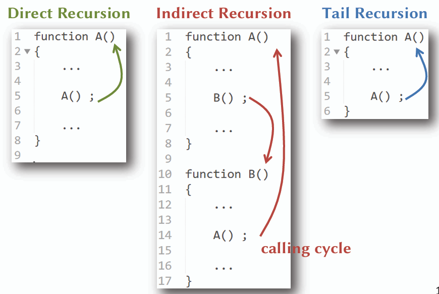

## 與非遞迴函數的比較

| 特性     | 遞迴函數(Recursive Function) | 非遞迴函數(Non-Recursive Function) |
| -------- | ---------------------------- | ---------------------------------- |
| 可讀性   | 通常較容易                   | 可能較不易                         |
| 簡潔性   | 通常較緊湊、簡潔             | 可能較複雜、冗長                   |
| 執行效率 | 可能較低(因為函式呼叫開銷)   | 通常較高                           |

# 空間複雜度(Space Complexity)

**空間複雜度是指演算法在執行過程中所需的記憶體空間量，通常以輸入資料的大小來表示。**

**空間複雜度通常被區分為下列兩部分:**

1. **固定部分 (Fixed Part):**

   指令本身的空間，例如簡單的變數、常數等。

2. **變動部分 (Variable Part):**

   資料所需的空間(遞迴的呼叫堆疊之類的)。

根據一個程式 P 的空間需求 S(p)，可以表示為:

```
S(p) = c + Sp
```

其中 c 為固定部分，Sp 為變動部分；而我們通常關注的是 Sp，因為它會隨著輸入資料的大小而改變。

# 時間複雜度

**時間複雜度是指演算法在執行過程中所需的時間量，通常以輸入資料的大小來表示。**

對於一個程式 P 的時間需求 T(p)，可以表示為:

```
T(p) = c + Tp
```

其中 c 是編譯時間(compile time)，而 Tp 則是運行時間(run|execution time);我們通常關注的是 Tp，因為它會隨著輸入資料的大小而改變。

有兩種方式可以勘定時間複雜度:

1. **測量(Measurement):**

   透過實際執行程式並測量其運行時間來估算時間複雜度(執行程式並記錄 CPU 時間)。

2. **分析(Analysis):**

計算程式步驟或是指令的數量。

## 時間複雜度的表示法

我們希望能用一些符號表示一個帶有 n 輸入的演算法函數 f(n)的時間或空間複雜度，接下來會介紹一些符號表示不精確但有意義的陳述。

## Big-Oh (O(n)):

定義:

```
O(g(n)) = { f(n) | 若且唯若「存在」正的常數c和n0，使得對所有n >= n0，有0 <= f(n) <= c*g(n) }
```

**對於當 n >= n0 的所有 n，在 f(n) = O(g(n)) 中，c\*g(n) 是 f(n) 的一個上界。**

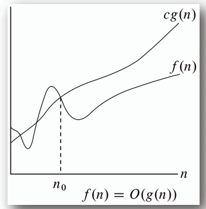
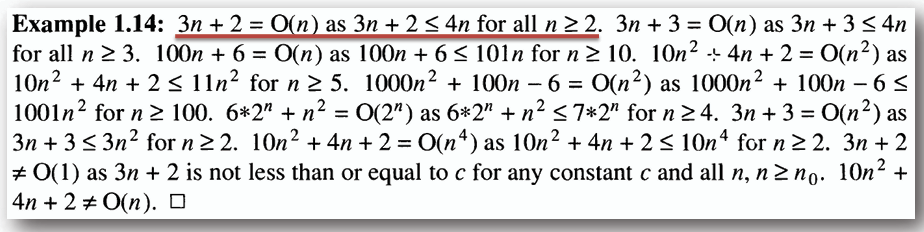

- 為使描述 f(n) = O(g(n)) 有意義，應選擇一個盡可能小的 g(n)。

- 常見的時間複雜度類型:
  |名字|符號|
  |---|---|
  |常數時間(constant)| O(1)|
  |對數時間(logarithmic)| O(log n)|
  |線性時間(linear)| O(n)|
  |線性對數時間(linearithmic)| O(n log n)|
  |平方時間(quadratic)| O(n^2)|
  |指數時間(exponential)| O(2^n)|
  |立方時間(cubic)| O(n^3)|
  |階乘時間(factorial)| O(n!)|
  |多項式時間(polynomial)| O(n^k) (k 為常數)|
  |指數時間(exponential)| O(k^n) (k 為常數)|
  |超指數時間(super-exponential)| O(n^n)|

  排序如下:

  ```
  O(1) < O(log n) < O(n) < O(n log n) < O(n^2) < O(n^3) < O(n^k) < O(2^n) < O(k^n) < O(n!) < O(n^n)
  ```

  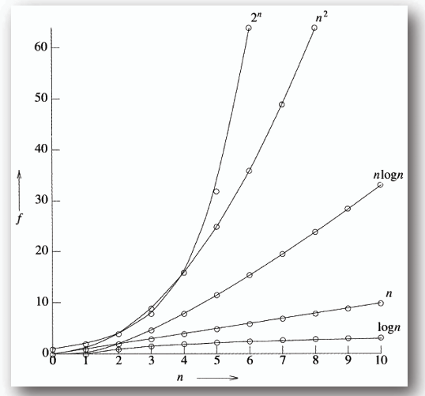

## Omega (Ω(n))

定義:

```
Ω(g(n)) = { f(n) | 若且唯若「存在」正的常數c和n0，使得對所有n >= n0，有0 <= c*g(n) <= f(n) }
```

**對於當 n >= n0 的所有 n，在 f(n) = Ω(g(n)) 中，c\*g(n) 是 f(n) 的一個下界。**

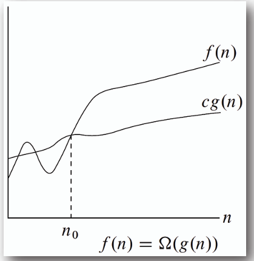
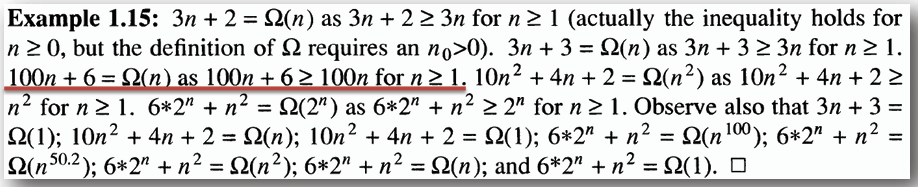

- 為使描述 f(n) = Ω(g(n)) 有意義，應選擇一個盡可能大的 g(n)。

## Theta (Θ(n))

定義:

```
Θ(g(n)) = { f(n) | 若且唯若「存在」正的常數c1、c2和n0，使得對所有n >= n0，有0 <= c1*g(n) <= f(n) <= c2*g(n) }
```

**是一個比 Big-Oh 和 Omega 更加精確的表示法，c\*g(n) 同時是 f(n) 的上界和下界。**

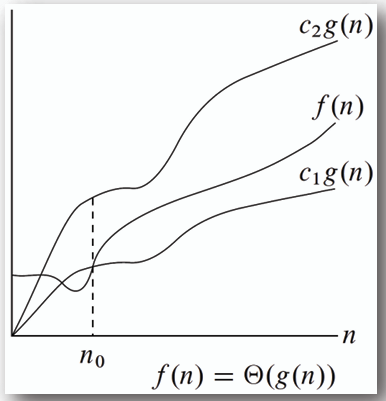
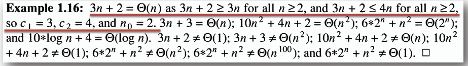

## 其他的表示法

1. 小 o 符號 (little o notation):

   定義:

   ```
   o(g(n)) = { f(n) | 對「所有」正的常數c，存在一個常數n0，使得對所有n >= n0，有0 <= f(n) < c*g(n) }
   ```

   **表示 f(n) 增長速度比 g(n) 慢得多。**

   跟 Big-Oh 的差別在於，Big-Oh 允許 f(n) 和 g(n) 增長速度相同，而小 o 則不允許。

2. 小 ω 符號 (little omega notation):

   定義:

   ```
   ω(g(n)) = { f(n) | 對「所有」正的常數c，存在一個常數n0，使得對所有n >= n0，有0 <= c*g(n) < f(n) }
   ```

   **表示 f(n) 增長速度比 g(n) 快得多。**

   跟 Omega 的差別在於，Omega 允許 f(n) 和 g(n) 增長速度相同，而小 ω 則不允許。

## 一些轉換(可能不用記...嗎?)

1. 若 f(n) = Θ(g(n)) 且 g(n) = Θ(h(n))，則 f(n) = Θ(h(n))。
2. 若 f(n) = O(g(n)) 且 g(n) = O(h(n))，則 f(n) = O(h(n))。
3. 若 f(n) = Ω(g(n)) 且 g(n) = Ω(h(n))，則 f(n) = Ω(h(n))。
4. 若 f(n) = o(g(n)) 且 g(n) = o(h(n))，則 f(n) = o(h(n))。
5. 若 f(n) = ω(g(n)) 且 g(n) = ω(h(n))，則 f(n) = ω(h(n))。
6. f(n) = Θ(g(n)) 若且唯若 g(n) = Θ(f(n))。
7. f(n) = O(g(n)) 若且唯若 g(n) = Ω(f(n))。
8. f(n) = o(g(n)) 若且唯若 g(n) = ω(f(n))。
9. f(n) = Θ(f(n))。
10. f(n) = O(f(n))。
11. f(n) = Ω(f(n))。

# 大師法則 (Master Method)

**大師法則是一種用來分析分治演算法時間複雜度的工具。**

## 大師法則的形式

對於一個遞迴關係式:

```
T(n) = aT(n/b) + f(n)
```

其中:

- a >= 1 是子問題的數量。
- b > 1 是每個子問題的規模縮小比例。
- f(n) 是合併子問題結果所需的時間。

## 大師法則的三種情況

1. **情況 1:**

   如果存在一個常數 ε > 0，使得:

   ```
   f(n) = O(n^(log_b(a) - ε))
   ```

   那麼:

   ```
   T(n) = Θ(n^(log_b(a)))
   ```

2. **情況 2:**

   如果存在一個常數 k >= 0，使得:

   ```
   f(n) = Θ(n^(log_b(a)) * log^k(n))
   ```

   那麼:

   ```
   T(n) = Θ(n^(log_b(a)) * log^(k+1)(n))
   ```

3. **情況 3:**

   如果存在一個常數 ε > 0，使得:

   ```
   f(n) = Ω(n^(log_b(a) + ε))
   ```

   且如果存在一個常數 c < 1，使得對所有足夠大的 n，有:

   ```
   a * f(n/b) <= c * f(n)
   ```

   那麼:

   ```
   T(n) = Θ(f(n))
   ```

# 陣列 Array

**陣列是含有多個鍵值對(pairs <index, value>)的資料結構，並使每個索引(index)都對到一個唯一的值(value)。**

## 2D 陣列

- **2D 陣列是陣列的陣列，又被稱為矩陣。**
- **一般由 m 個行(row)和 n 個列(column)組成，若行列數相等則為方陣(square matrix)。**
  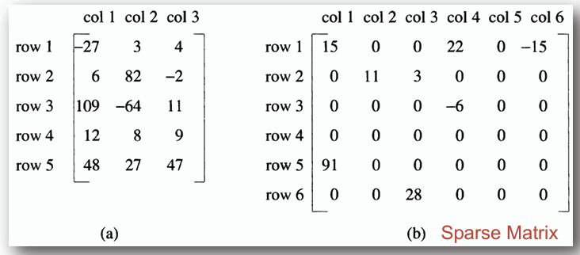

- **對於矩陣 A，元素 A~i,j~ = A[i-1][j-1]**
- **矩陣能以兩種方法表示:**

  ## 1. 行主序(row-major order):

  - **對於矩陣 A，行主序會將 A~1,1~、A~1,2~、...、A~1,n~ 依序存放，接著是 A~2,1~、A~2,2~、...、A~2,n~，以此類推。**

  ```
  (3x3 matrix)
  [27,31, -4,
   5, 8, 16, => [27,31,-4,5,8,16,7,10,15]
   7,10, 15]    (A1,1,A1,2,A1,3,A2,1,A2,2,A2,3,A3,1,A3,2,A3,3)
  ```

  - **對於 m x n 的矩陣 A，元素 Ai,j 在一維陣列中的位置為:**

  ```
  ls + [(i - 1) * n + (j - 1)] * d
  ```

  其中 ls 為陣列的起始位置，d 為每個元素的大小。

  ## 2. 列主序(column-major order):

  - **對於矩陣 A，列主序會將 A1,1、A2,1、...、Am,1 依序存放，接著是 A1,2、A2,2、...、Am,2，以此類推。**
    ```
    (3x3 matrix)
    [27,31, -4,
     5, 8, 16, => [27,5,7,31,8,10,-4,16,15]
     7,10, 15]    (A1,1,A2,1,A3,1,A1,2,A2,2,A3,2,A1,3,A2,3,A3,3)
    ```
  - **對於 m x n 的矩陣 A，元素 A~i,j~ 在一維陣列中的位置為:**
    ```
    ls + [(j - 1) * m + (i - 1)] * d
    ```
    其中 ls 為陣列的起始位置，d 為每個元素的大小。

## 三角矩陣

### 1. 下三角矩陣 (Lower Triangular Matrix)

- **一個方陣(Square Matrix)A 的第 i 行最大的非零項目數是 i，且當 i < j 時，A~i,j~ = 0，這樣的矩陣稱為下三角矩陣。**
- **下三角矩陣的非零項目數為:**

  ```
  n(n + 1) / 2
  ```

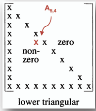

- ## 位置表示

  - ## 行主序(row-major order):

    **對於 n x n 的下三角矩陣 A，元素 A~i,j~ 在一維陣列中的位置為:**

    ```
    ∀i ≥ j, Location(Ai,j) = ls + [(i * (i - 1)) / 2 + j - 1] * d
    ```

    其中 ls 為陣列的起始位置，d 為每個元素的大小。

  - ## 列主序(column-major order):
    **對於 n x n 的下三角矩陣 A，元素 A~i,j~ 在一維陣列中的位置為:**
    ```
    ∀i ≥ j, Location(Ai,j) = ls + [((2n - j)(j - 1)) / 2 + i - 1] * d
    ```
    其中 ls 為陣列的起始位置，d 為每個元素的大小。

### 2. 上三角矩陣 (Upper Triangular Matrix)

- **一個方陣(Square Matrix)A 的第 i 行最小的非零項目數是 i，且當 i > j 時，Ai,j = 0，這樣的矩陣稱為上三角矩陣。**
- **上三角矩陣的非零項目數為:**

  ```
  n(n + 1) / 2
  ```

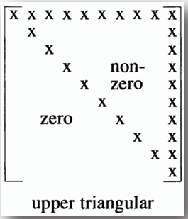

- ## 位置表示
  - ## 行主序(row-major order):
    **對於 n x n 的上三角矩陣 A，元素 A~i,j~ 在一維陣列中的位置為:**
    ```
    ∀i ≤ j, Location(Ai,j) = ls + [((2n - i)(i - 1)) / 2 + j - 1] * d
    ```
    其中 ls 為陣列的起始位置，d 為每個元素的大小。
  - ## 列主序(column-major order):
    **對於 n x n 的上三角矩陣 A，元素 A~i,j~ 在一維陣列中的位置為:**
    ```
    ∀i ≤ j, Location(Ai,j) = ls + [(j * (j - 1)) / 2 + i - 1] * d
    ```
    其中 ls 為陣列的起始位置，d 為每個元素的大小。

# 鏈結串列 Linked List

**鏈結串列是一種動態資料結構，由一系列節點(node)組成，每個節點包含一個或多個資料和指向下一個節點的指標(pointer)。**

## 單向鏈結串列 (Singly Linked List)

- **每個節點包含兩個部分: 資料(data)和指向下一個節點的指標(next pointer)。**
- **最後一個節點的 next 指標指向 null，表示鏈結串列的結束。**

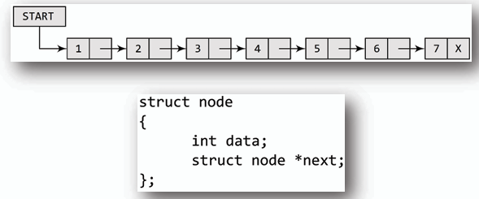

## 環狀鏈結串列 (Circular Linked List)

- **最後一個節點的 next 指標指向鏈結串列的第一個節點，形成一個環狀結構。**

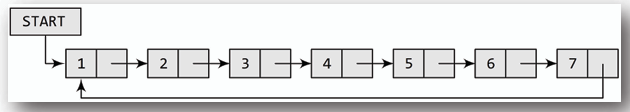

## 雙向鏈結串列 (Doubly Linked List)

- **每個節點包含三個部分: 資料(data)、指向下一個節點的指標(next pointer)和指向前一個節點的指標(prev pointer)。**
- **這種結構允許雙向遍歷鏈結串列。**

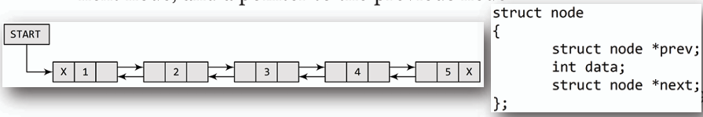

## 雙向環狀鏈結串列 (Doubly Circular Linked List)

- **最後一個節點的 next 指標指向鏈結串列的第一個節點，而第一個節點的 prev 指標指向最後一個節點，形成一個雙向環狀結構。**

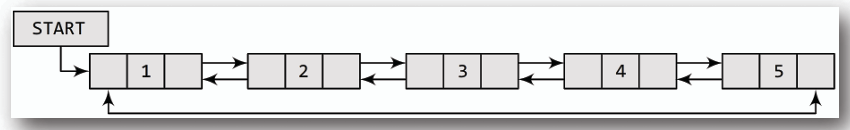

## 其與陣列之比較

| 特性           | 陣列(Array)            | 鏈結串列(Linked List)    |
| -------------- | ---------------------- | ------------------------ |
| 記憶體配置     | 靜態配置，大小固定     | 動態配置，大小可變       |
| 連續性         | 元素連續存放           | 元素不一定連續存放       |
| 存取方式       | 透過索引存取           | 需從頭節點遍歷           |
| 存取時間       | O(1) (透過索引)        | O(n) (需遍歷)            |
| 插入/刪除時間  | O(n) (需移動元素)      | O(1) (只需更新指標)      |
| 記憶體使用效率 | 可能浪費空間(預留空間) | 節點需額外指標空間       |
| 資料局部性     | 較好，適合快取         | 較差，可能導致快取未命中 |

# 堆疊 Stack

**堆疊是一種後進先出(Last In First Out, LIFO)的資料結構，允許在一端進行插入(push)和刪除(pop)操作。**

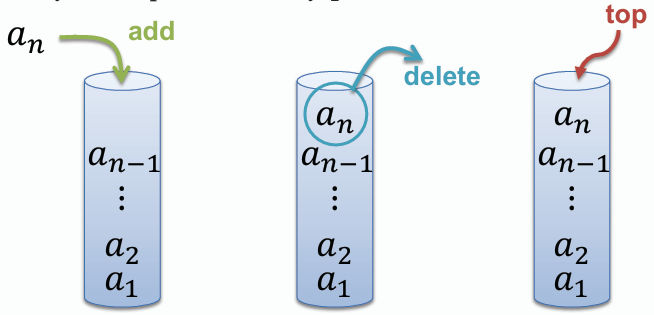

## 以鏈結串列實作堆疊

- **若資料大小無法確定，則能以鏈結串列實作堆疊。**
- **堆疊的頂端(top)指向鏈結串列的第一個節點。**

- ## 操作

  1. **Push(插入):**

     - **建立一個新節點，將資料存入，並將其 next 指標指向目前的頂端節點，然後更新頂端指標指向新節點。**

     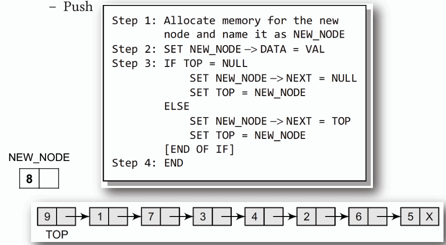

  2. **Pop(刪除):**

     - **檢查堆疊是否為空，若不為空，則將頂端指標指向下一個節點，並釋放原頂端節點的記憶體。**

     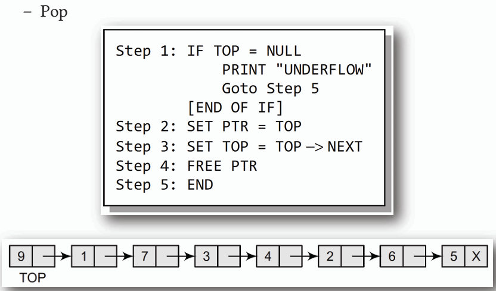

  3. **Peek(查看頂端元素):**

     - **返回頂端節點的資料，但不刪除該節點。**

     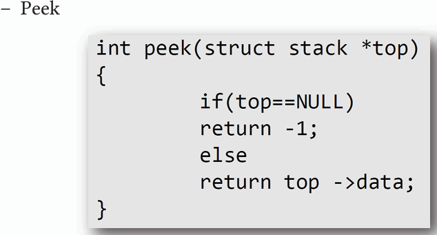

## 堆疊排列 Stack Permutation

- **給定一個輸入序列，堆疊排列是指透過堆疊操作所能產生的所有可能輸出序列。**
- **例如，對於輸入序列 [1, 2, 3]，可能的堆疊排列包括:**

```
[1, 2, 3] => push 1, pop 1, push 2, pop 2, push 3, pop 3
[1, 3, 2] => push 1, pop 1, push 2, push 3, pop 3, pop 2
[2, 1, 3] => push 1, push 2, pop 2, pop 1, push 3, pop 3
[2, 3, 1] => push 1, push 2, pop 2, push 3, pop 3, pop 1
[3, 2, 1] => push 1, push 2, push 3, pop 3, pop 2, pop 1
```

- **並非所有排列都能透過堆疊操作產生，例如 [3, 1, 2] 無法透過堆疊操作達成。**

- ## 卡塔蘭數 (Catalan Number)

  - **卡塔蘭數是一系列自然數，常用於計算堆疊排列的數量。第 n 個卡塔蘭數 C(n) 定義為:**

  ```
  C(n) = (1 / (n + 1)) * (2n choose n) = (2n)! / ((n + 1)! * n!)
  ```

  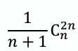

  - **對於 n 個元素的輸入序列，可能的堆疊排列數量為第 n 個卡塔蘭數 C(n)。**

# 佇列 Queue

**佇列是一種先進先出(First In First Out, FIFO)的資料結構，允許在一端(rear)進行插入操作，在另一端(front)進行刪除操作。**

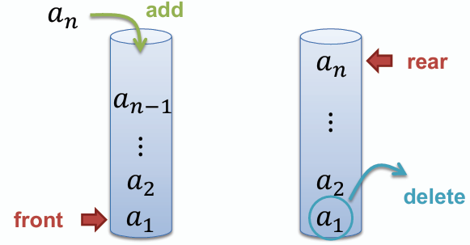

## 以陣列實作佇列

- **使用固定大小的陣列來存放佇列元素，並使用兩個指標(front 和 rear)來追蹤佇列的前端和後端位置。**
- **當 rear 到達陣列末端時，可以將其重新指向陣列的起始位置，形成環狀佇列(circular queue)。**

- ## 操作

  0. **宣告**

     ```c++
     #define MAX 10 //改變此值將會改變陣列大小
     int queue[MAX];
     int front = -1, rear = -1;
     void insert(void);
     int delete_element(void);
     void display(void);
     ```

  1. **Insert(插入):**

     - **將新元素加入到 rear 指標所指的位置，然後更新 rear 指標指向下一個位置。**

     ```c++
     void insert() {
       int num;
       printf("Enter a number to insert: ");
       scanf("%d", &num);

       if(rear == MAX-1) printf("\n OVERFLOW");
       else if(front == -1 && rear == -1)front = rear = 0;
       else {
           rear++;
           queue[rear] = num;
       }
     }
     ```

  2. **Delete(刪除):**

     - **從 front 指標所指的位置移除元素，然後更新 front 指標指向下一個位置。**

     ```c++
     int delete_element() {
       if(front == -1){
           printf("\n UNDERFLOW");
           return -1;
       }
       else {
           val = queue[front];
           front++;
           if(front > rear) front = rear = -1;
           return val;
       }
     }
     ```

  3. **Display(查看前端元素):**

     - **返回 front 指標所指的元素，但不刪除該元素。**

     ```c++
     void display() {
       int i;
       printf("\n");
       if(front == -1) printf("Queue is empty");
       else {
           for(i = front; i <= rear; i++) {
               printf("\t %d", queue[i]);
           }
       }
     }
     ```

## 以鏈結串列實作佇列

- **比起使用陣列，鏈結串列在插入和刪除操作上更具彈性，無需考慮容量限制。**

- ## 操作

  0. **Declare(宣告)**

     ```c++
     #include <stdio.h>
     #include <conio.h>
     #include <malloc.h>
     struct node {
         int data;
         struct node *next;
     };
     struct queue {
         struct node *front;
         struct node *rear;
     };
     struct queue *q;
     void create_queue(struct queue *);
     struct queue *insert(struct queue *, int);
     struct queue *delete_element(struct queue *);
     ```

  1. **Create(建立):**

     - **初始化佇列，將 front 和 rear 指標設為 null。**

     ```c++
     void create_queue(struct queue *q) {
       q->front = NULL;
       q->rear = NULL;
     }
     ```

  2. **Insert(插入):**

     - **建立一個新節點，將資料存入，並將其加入到佇列的 rear 位置，然後更新 rear 指標。**

     ```c++
     struct queue *insert(struct queue *q, int value) {
       struct node *new_node;
       new_node = (struct node *)malloc(sizeof(struct node));
       new_node->data = value;

       if(q->front == NULL) {
           q->front = new_node;
           q->rear = new_node;
           q->front->next = NULL;
           q->rear->next = NULL;
       }
       else {
           q->rear->next = new_node;
           q->rear = new_node;
           q->rear->next = NULL;
       }
       return q;
     }
     ```

  3. **Delete(刪除):**

     - **從佇列的 front 位置移除元素，然後更新 front 指標。**

     ```c++
     struct queue *delete_element(struct queue *q) {
       struct node *temp;
       temp = q->front;
       if(q->front == NULL) {
           printf("\n UNDERFLOW");
       }
       else {
           q->front = q->front->next;
           printf("\n Deleted element is %d", temp->data);
           free(temp);
       }
       return q;
     }
     ```

## 各種變體

1. ## 環形佇列 (Circular Queue)

   - **環形佇列是一種特殊的佇列，當 rear 指標到達陣列末端時，會重新指向陣列的起始位置，形成一個環狀結構。**

     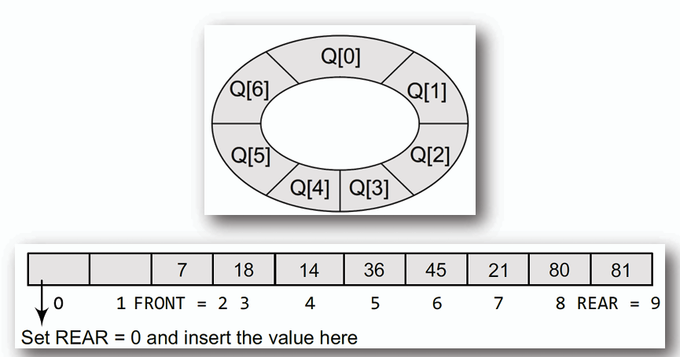

   - **無法對已滿的佇列進行插入，即便刪除了元素，其已經不具備可被插入的性質。**

2. ## 雙端佇列 (Deque - Double-Ended Queue)

   - **雙端佇列允許在兩端進行插入和刪除操作，提供更大的靈活性。**
   - **具有兩個指標，RIGHT 以及 LEFT，任何插入刪除行為無法在中間進行。**

     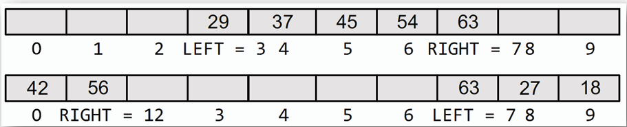

   - ## 輸入限制雙端佇列 (Input-Restricted Deque)

     **只能在一端進行插入操作，但可以在兩端進行刪除操作。**

   - ## 輸出限制雙端佇列 (Output-Restricted Deque)

     **可以在兩端進行插入操作，但只能在一端進行刪除操作。**

3. ## 優先佇列 (Priority Queue)

   - **優先佇列是一種特殊的佇列，其中每個元素都有一個優先級，元素被處理的順序取決於其優先級，而非插入順序；具有相同優先級的元素會按照插入順序處理(FCFS, First-Come-First-Served)。**
   - **廣泛適用於各種操作系統，如煞車優先系統(BOS, Brake Override System)。**

   - ## 實作方法(Array)

     - **每個優先級(priority)都有自己的佇列，以及對應的 front 和 rear 指標。**

       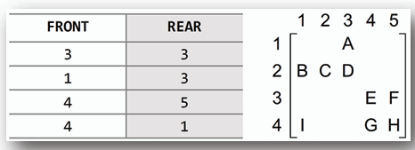

     - **插入操作根據元素的優先級將其加入對應的佇列。(以插入元素 R 的優先級為 3 的範例)**

       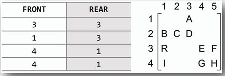

   - ## 實作方法(鏈結串列)

     - **每個節點都有三個部分：資料區、優先級區和指向下一個節點的指標。**

       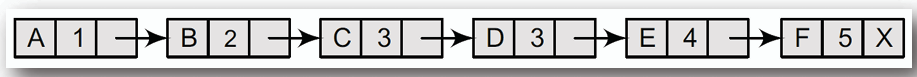

     - **此鏈結串列具以下特點，舉例來說:**

       1. **由於 A 具有比 B 更高的優先級(1<2)，因此 A 會被插入到 B 的前面。**
       2. **C 和 D 具有相同的優先級(2)，因此它們依先來後到被排列並被處理。**
       3. **優先級以適當將元素排列，我們無法得知低優先級的元素是否比高優先級還要先到。**

# 算術表示法 Arithmetic Expression

**算術表示法是用來表示數學運算的符號系統，常見的表示法有中序表示法(Infix Notation)、前序表示法(Prefix Notation)和後序表示法(Postfix Notation)。**

- **為什麼我們習慣使用中序表示法，卻還需要前序和後序表示法呢？**

  對於人類來說，中序表示法較為直觀且易於理解，因為它符合我們日常使用的數學表達方式。然而，對於計算機來說，中序表示法需要額外的規則來處理運算優先級和括號，這使得解析和計算變得複雜。前序和後序表示法則不需要括號，且運算優先級是由符號的位置決定的，因此更適合計算機進行處理。

- **舉例來說:**

  | 表示法 | 例子       |
  | ------ | ---------- |
  | 中序   | A + B \* C |
  | 前序   | + A \* B C |
  | 後序   | A B C \* + |

- **簡單將中序表示轉換為前/後序表示的描述:**

  1. 將表達式完全補上括號
  2. 將所有運算子取代其對應的左/右括號
  3. 移除所有括號

  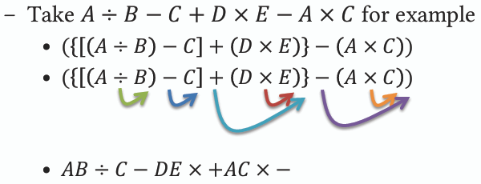

## 將中序轉後序的演算法

1. **建立一個空的堆疊(stack)和一個空的輸出串列(output list)。**
2. **從左到右掃描中序表示法的每個符號:**

   - **如果符號是運算元(operand)，將其加入輸出串列。**
   - **如果符號是左括號'('，將其推入堆疊。**
   - **如果符號是右括號')'，則從堆疊中彈出運算子並加入輸出串列，直到遇到左括號為止，並取出左括號。**
   - **如果符號是運算子(operator)，則從堆疊中彈出運算子並加入輸出串列，直到堆疊頂端的運算子優先級低於當前運算子，然後將當前運算子推入堆疊。**

     **運算子優先級如下:**
     |優先級|運算子|
     |---|---|
     |1| -(一元負號)|
     |2| not|
     |3| \*. /, %, &|
     |4| +, -, \^(xor), \| |
     |5| <, <=, >, >=, =, != |

3. **掃描結束後，將堆疊中剩餘的運算子全部彈出並加入輸出串列。**
4. **輸出串列即為後序表示法。**

- **舉 (A - (B / C +(D % E \* F) / G) \* H) 為例:**
  | 步驟 | 符號 | 堆疊(Stack) | 輸出串列(Output List) |
  | ---- | ---- | ------------------ | -------------------------- |
  | 1 | \( | \( | |
  | 2 | A | \( | A |
  | 3 | - | \(- | A |
  | 4 | \( | \(-\( | A |
  | 5 | B | \(-\( | AB |
  | 6 | / | \(-\(/ | AB |
  | 7 | C | \(-\(/ | ABC |
  | 9 | + | \(-\(+ | ABC/ |
  | 10 | \( | \(-\(+\( | ABC/ |
  | 11 | D | \(-\(+\( | ABC/D |
  | 12 | % | \(-\(+\(% | ABC/D |
  | 13 | E | \(-\(+\(% | ABC/DE |
  | 14 | \* | \(-\(+\(\* | ABC/DE% |
  | 15 | F | \(-\(+\(\* | ABC/DE%F |
  | 16 | \) | \(-\(+ | ABC/DE%F\* |
  | 17 | / | \(-\(+/ | ABC/DE%F\* |
  | 18 | G | \(-\(+/ | ABC/DE%F\*G |
  | 19 | \) | \(- | ABC/DE%F\*G/+ |
  | 20 | \* | \(-\* | ABC/DE%F\*G/+ |
  | 21 | H | \(-\* | ABC/DE%F\*G/+H |
  | 22 | \) | | ABC/DE%F\*G/+H\*- |

## 計算後序表示法的值

1. **建立一個空的堆疊(stack)。**
2. **從左到右掃描後序表示法的每個符號:**

   - **如果符號是運算元(operand)，將其推入堆疊。**
   - **如果符號是運算子(operator)，則從堆疊中彈出兩個運算元，根據運算子進行計算 B op A(A 是最上面彈出的運算元，B 是 A 下面的的運算元)，然後將結果推入堆疊。**

3. **掃描結束後，堆疊中唯一的元素即為後序表示法的計算結果。**

- **舉 934\*8+4/- 為例:**
  | 步驟 | 符號 | 堆疊(Stack) |
  | ---- | ---- | ------------------ |
  | 1 | 9 | 9 |
  | 2 | 3 | 9, 3 |
  | 3 | 4 | 9, 3, 4 |
  | 4 | \* | 9, 12 |
  | 5 | 8 | 9, 12, 8 |
  | 6 | + | 9, 20 |
  | 7 | 4 | 9, 20, 4 |
  | 8 | / | 9, 5 |
  | 9 | - | 4 |

# 樹 Tree

**樹是一種非線性(non-linear)資料結構，由節點(node)組成，節點之間透過邊(edge)連接，形成層次(hierarchical)結構。**

- **對於下圖的樹:**

  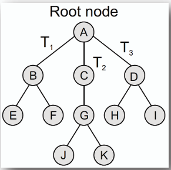

  - 節點 B, C, D 是節點 A 的子節點(children)。
  - 節點 A 是節點 B, C, D 的父節點(parent)。
  - **根節點(root node):** 代表整個樹的頂端節點，在此例中為節點 A。
  - **葉/終端節點(leaf/ terminal node):** 沒有子節點的節點，在此例中為節點 E, F, J, K, H, I。
  - **子樹(subtree):** 由某節點及其所有後代節點所組成的樹，如 T1, T2, T3。
  - **路徑(path):** 由一連串節點所組成的序列，從一個節點到另一個節點的連接。如: 從節點 A 到節點 I 的路徑為 `A -> D -> I`。
  - **祖輩節點(ancestor node):** 某節點的所有上層節點，從該節點一直到根節點的路徑上的節點。如: 節點 I 的祖先節點為 D 和 A。
  - **孫輩節點(descendant node):** 某節點的所有下層節點，從該節點一直到葉節點的路徑上的節點。如: 節點 E 和 F 是節點 B 的孫輩節點。
  - **層數(level number):** 節點所在的層次，根節點的層數為 0，其子節點的層數為 1，依此類推。如:節點 H 和 I 的層數為 2。
  - **度(degree):** 節點的子節點數量。如: 節點 A 的度為 3，節點 B 的度為 2，節點 E 的度為 0。

## 二元樹 Binary Tree

**二元樹是一種特殊的樹結構，其中每個節點最多有 0, 1, 2 個子節點，分別稱為左子節點(left child)和右子節點(right child)。**

- **手足節點(sibling node):** 具有相同階層及父節點的節點稱為手足節點。
- **高度(height):** 節點到其最遠葉節點的節點總數；一棵高度為 h 的二元樹最少有 2^h - 1 個節點。
- **形似(similar):** 兩棵二元樹若其結構相同，則稱為形似的二元樹。
- **複製(copies):** 將一棵二元樹形似且資料一致於另一棵二元樹，稱為複製。

- ## 將通用樹(General Tree)轉換為二元樹(Binary Tree)

  **將通用樹的每個節點的第一個子節點作為二元樹的左子節點，其他子節點則依序作為右子節點。**

  **例如，通用樹中的節點 A 有三個子節點 B, C, D，在轉換後的二元樹中，B 成為 A 的左子節點，C 成為 B 的右子節點，D 成為 C 的右子節點。**

- ## 實作(Array)
  - **使用陣列來表示二元樹，對於節點在陣列中的位置 i，其左子節點的位置為 2i + 1，右子節點的位置為 2i + 2，父節點的位置為 (i - 1) / 2。**
    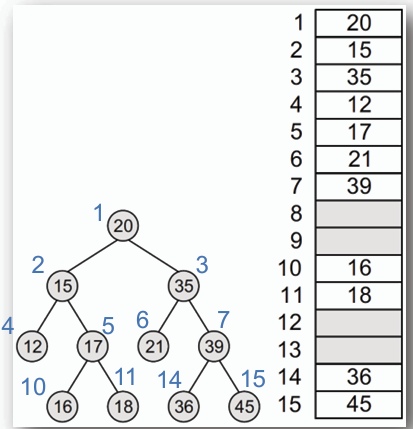
- ## 實作(Linked List)
  - **使用節點結構來表示二元樹，每個節點包含資料(data)、指向左子節點的指標(left pointer)和指向右子節點的指標(right pointer)。**
    ```c++
    struct node {
        int data;
        struct node *left;
        struct node *right;
    };
    ```

## 完全二元樹 Complete Binary Tree

**完全二元樹是一種特殊的二元樹，除了最後一層外，每一層的節點數量都達到最大值，且最後一層的節點從左至右依序填滿。**

- **例如，以下的二元樹為完全二元樹:**

  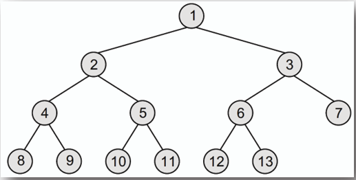

- **而以下的二元樹則不是完全二元樹，因為最後一層的節點沒有從左至右依序填滿:**

  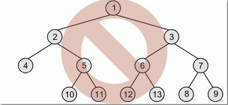

## 延展二元樹 Extended Binary Tree

- **延展二元樹是一種特殊的二元樹，其中每個非葉節點都有兩個子節點，葉節點則沒有子節點。**
- **為了達成這個目的，延展二元樹會在原本的葉節點位置插入額外的空節點(null node)，使得每個非葉節點都有兩個子節點。**

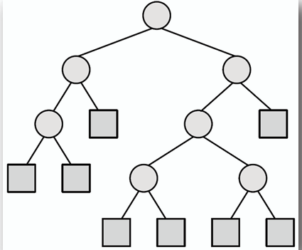

## 競賽/選擇樹 Tournament/Selection Tree

- **競賽樹是一種特殊的二元樹，用於模擬比賽過程，其中每個非葉節點代表一場比賽的勝者，葉節點則代表參賽者。**
- **在競賽樹中，葉節點通常存放參賽者的資料，而非葉節點則存放比賽結果，如勝者的資料或分數。**

## 二元樹的遍歷 Binary Tree Traversal

**二元樹的遍歷是指按照特定順序訪問二元樹中的每個節點。常見的遍歷方法有前序遍歷(preorder traversal)、中序遍歷(inorder traversal)和後序遍歷(postorder traversal)。**

- **前序遍歷(Preorder Traversal):** 先訪問根節點，然後遞迴訪問左子樹，最後遞迴訪問右子樹。
- **中序遍歷(Inorder Traversal):** 先遞迴訪問左子樹，然後訪問根節點，最後遞迴訪問右子樹。
- **後序遍歷(Postorder Traversal):** 先遞迴訪問左子樹，然後遞迴訪問右子樹，最後訪問根節點。
- **階序遍歷(Level-order Traversal):** 按照層次從上到下、從左到右依序訪問節點。

- **例如，對於以下的二元樹:**

  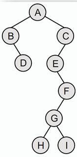

  - 前序遍歷結果為: A, B, D, C, E, F, G, H, I
  - 中序遍歷結果為: B, D, A, E, H, G ,I, F, C
  - 後序遍歷結果為: D, B, H, I, G, F, E, C, A
  - 階序遍歷結果為: A, B, C, D, E, F, G, H, I

- ### 藉由遍歷構建二元樹

  **給定前序和中序遍歷序列，可以唯一確定一棵二元樹，並透過遞迴方法構建該二元樹。**

  **同理，給定後序和中序遍歷序列也可以唯一確定一棵二元樹，並透過遞迴方法構建該二元樹。**

  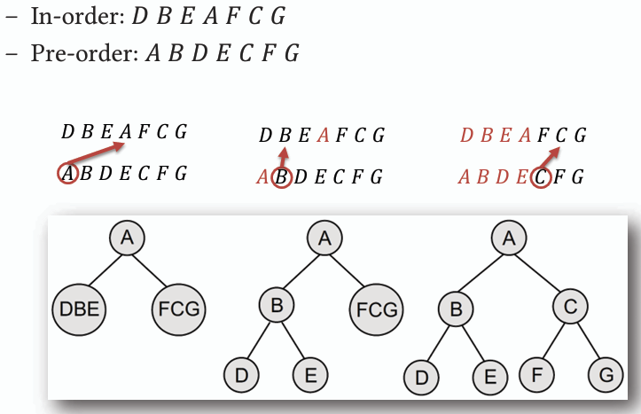

  - #### 補充:可定義二元樹的方法(Midterm 2023)

    透過任選集合 A 和集合 B，各選一項即可定義二元樹:

    - 集合 A:
      1. 階序 Level-order
      2. 前序 Pre-order
      3. 後序 Post-order
    - 集合 B:
      1. 二元搜尋樹 Binary Search Tree
      2. 完全二元樹 Complete Binary Tree
      3. 中序 In-order

    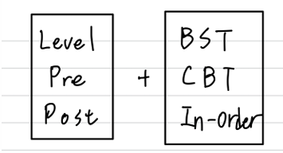

## 引線二元樹 Threaded Binary Tree

**引線二元樹是一種特殊的二元樹，利用空指標來建立節點之間的連結，使得在不使用堆疊或遞迴的情況下也能進行遍歷。**

**在引線二元樹中，若節點的左子指標為 null，則將其指向該節點在中序遍歷中的前驅(predecessor)節點；若節點的右子指標為 null，則將其指向該節點在中序遍歷中的後繼(successor)節點。**

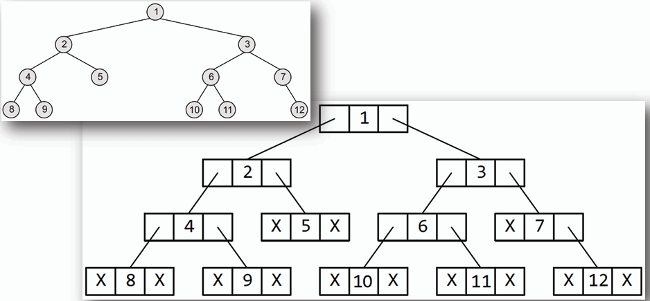

- ## 單路徑引線二元樹(One-way Threaded/Single-Threaded Binary Tree)

  **每個節點只有一個空指標被用來建立引線，若右側出現引線，則他會指向該節點在中序遍歷中的後繼(successor)節點，此樹稱右引線二元樹(right-threaded binary tree)；而若左側出現引線，則他會指向該節點在中序遍歷中的前驅(predecessor)節點，此樹稱左引線二元樹(left-threaded binary tree)。**

  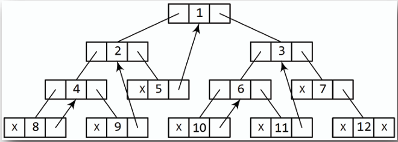

- ## 雙路徑引線二元樹(Two-way Threaded/Double-Threaded Binary Tree)/完全引線二元樹(Full Threaded Binary Tree)

  **每個節點的兩個空指標都被用來建立引線，左側的引線指向該節點在中序遍歷中的前驅(predecessor)節點，右側的引線指向該節點在中序遍歷中的後繼(successor)節點。**

  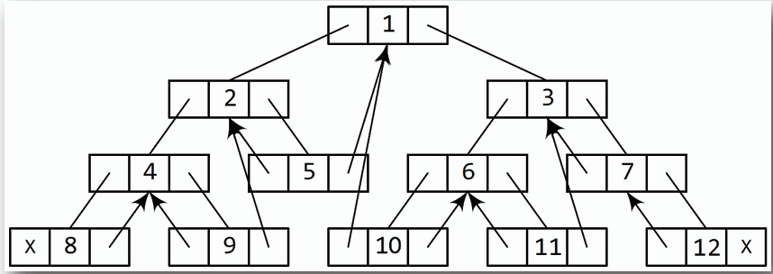

# 各種重要的二元樹變體

## 二元搜尋樹 Binary Search Tree

**二元搜尋樹是一種特殊的二元樹，其中每個節點的左子樹包含的所有節點值均小於該節點值，右子樹包含的所有節點值均大於該節點值。**

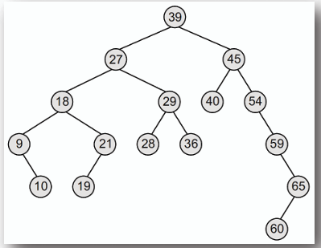

### 搜尋 Search

- **從根節點開始，若搜尋值小於當前節點值，則遞迴搜尋左子樹；若搜尋值大於當前節點值，則遞迴搜尋右子樹；若相等則找到該節點。**

- **c++ 範例:**
  ```c++
  node *search(node *root, int key) {
      if(root == NULL)
        return &nullNode;// A nullNode is a global node indicating not found
      if (root->data == key)
          return root;
      if (key < root->data)
          return search(root->left, key);
      return search(root->right, key);
  }
  ```

### 插入 Insert

- **從根節點開始，若插入值小於當前節點值，則遞迴插入左子樹；若插入值大於當前節點值，則遞迴插入右子樹；直到找到適當的空位置，將新節點插入。**
- **c++ 範例:**
  ```c++
  node* insert(node* root, int key) {
      if (root == NULL) {
          return newNode(key);
      }
      if (key < root->data) {
          root->left = insert(root->left, key);
      } else {
          root->right = insert(root->right, key);
      }
      return root;
  }
  ```

### 刪除 Delete

- **從根節點開始，尋找要刪除的節點。若找到該節點，根據其子節點數量進行刪除操作:**
  1. **若該節點沒有子節點，直接刪除該節點。**
  2. **若該節點有一個子節點，將該節點的父節點指向其唯一的子節點，然後刪除該節點。**
  3. **若該節點有兩個子節點，找到該節點右子樹中的最小值節點(或左子樹中的最大值節點)，將其值複製到要刪除的節點，然後遞迴刪除該最小值(或最大值)節點。**
- **c++ 範例:**
  ```c++
  node* deleteNode(node* root, int key) {
      if (root == NULL) return root;
      if (key < root->data) {
          root->left = deleteNode(root->left, key);
      } else if (key > root->data) {
          root->right = deleteNode(root->right, key);
      } else {
          // Node with only one child or no child
          if (root->left == NULL) {
              node* temp = root->right;
              free(root);
              return temp;
          } else if (root->right == NULL) {
              node* temp = root->left;
              free(root);
              return temp;
          }
          // Node with two children: Get the inorder successor (smallest in the right subtree)
          node* temp = minValueNode(root->right);
          root->data = temp->data;
          root->right = deleteNode(root->right, temp->data);
      }
      return root;
  }
  ```

## AVL 樹 AVL Tree

**AVL 樹是一種自平衡的二元搜尋樹，透過在每個節點維護一個平衡因子(balance factor)，並使每個節點的平衡因子為-1、0 或 1 ，以此確保樹的高度保持在 O(log n) 的範圍內。**

**一個合法的 AVL 樹有三種情況:**

1. **根節點平衡因子為 0，表示左子樹和右子樹高度相等。(Balanced)**
2. **根節點平衡因子為 1，表示左子樹高度比右子樹高 1。(Left heavy)**
3. **根節點平衡因子為 -1，表示右子樹高度比左子樹高 1。(Right heavy)**

### 搜尋 Search

- **與二元搜尋樹的搜尋方法相同，從根節點開始，根據搜尋值與當前節點值的比較結果，遞迴搜尋左子樹或右子樹，直到找到該節點或達到葉節點。**

### 插入 Insert

- **與二元搜尋樹的插入方法相同，將新節點插入到適當的位置。**
- **插入新節點後，從插入點回溯至根節點，更新每個節點的高度和計算平衡因子。若發現某個節點的平衡因子不在 -1 至 1 範圍內，則進行適當的旋轉操作以恢復平衡。**
- **旋轉操作包括:**

  1. **雙右臂旋(Right-Right Rotation):** 用於左子樹過高的情況。

  - 插入 89

    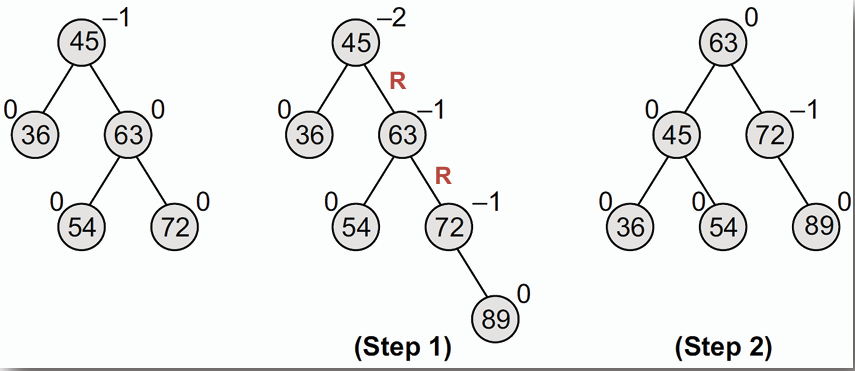

    插入 89 後，使得根節點的平衡因子為-2，是 Right heavy 的情況，因此需要進行雙右臂旋來恢復平衡。

    取根節點的右節點 63 作為新的根節點，並將原本的根節點 45 設為 63 的左子節點，63 的左子節點 54 設為 45 的右子節點。

  2. **雙左臂旋(Left-Left Rotation):** 用於右子樹過高的情況。

  - 插入 18

    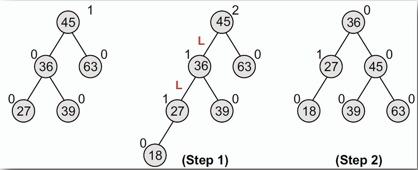

    插入 18 後，使得根節點的平衡因子為 2，是 Left heavy 的情況，因此需要進行雙左臂旋來恢復平衡。

    取根節點 36 作為新的根節點，並將原本的根節點 45 設為 36 的右子節點，36 的右子節點 39 設為 45 的左子節點。

  3. **左右臂旋(Left-Right Rotation):** 用於左子樹的右子樹過高的情況。

  - 插入 37

    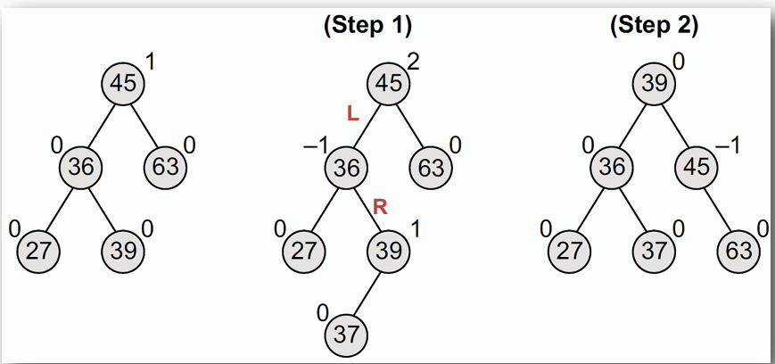

    插入 37 後，使得根節點的平衡因子為 2，是 Left heavy 的情況，但根節點 45 的左子節點 36 的平衡因子為-1，是 Right heavy 的情況。

    因此需要先對 36 進行右臂旋，再對根節點 45 進行左臂旋來恢復平衡。

  4. **右左臂旋(Right-Left Rotation):** 用於右子樹的左子樹過高的情況。

  - 插入 60

    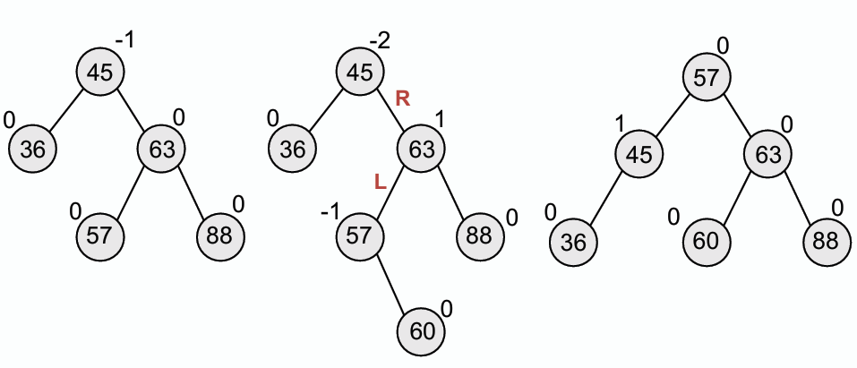

    插入 60 後，使得根節點的平衡因子為-2，是 Right heavy 的情況，但根節點 45 的右子節點 63 的平衡因子為 1，是 Left heavy 的情況。

    因此需要先對 63 進行左臂旋，再對根節點 45 進行右臂旋來恢復平衡.

### 刪除 Delete

- **與二元搜尋樹的刪除方法相同，尋找並刪除指定節點。**
- **刪除節點後，從刪除點回溯至根節點，更新每個節點的高度和計算平衡因子。若發現某個節點的平衡因子不在 -1 至 1 範圍內，則進行適當的旋轉操作以恢復平衡。**
- **旋轉操作包括:**

  1. **R0 旋轉(R0 Rotation):** 用於旋轉後的新根原平衡因子為 0 的情況，包含 RR 或 LL 旋轉。

  - 刪除 72

    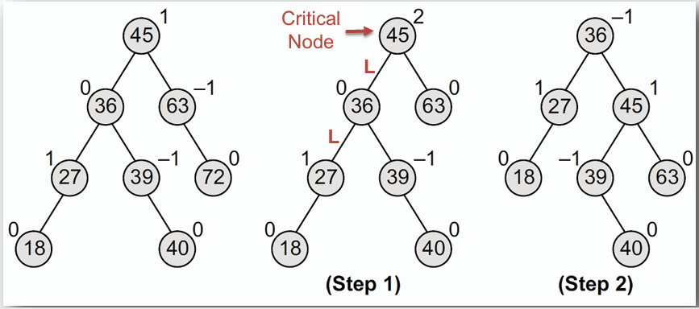

    刪除 72 後，使得根節點的平衡因子為 2，是 Left heavy 的情況，因此需要進行 R0 旋轉來恢復平衡。

    取根節點 45 的左子節點 36 作為新的根節點，並將原本的根節點 45 設為 36 的右子節點，36 的右子節點 39 設為 45 的左子節點。

  2. **R1 旋轉(R1 Rotation):** 用於旋轉後的新根原平衡因子為 1 的情況，包含 LL 或 RL 旋轉。

  - 刪除 72

    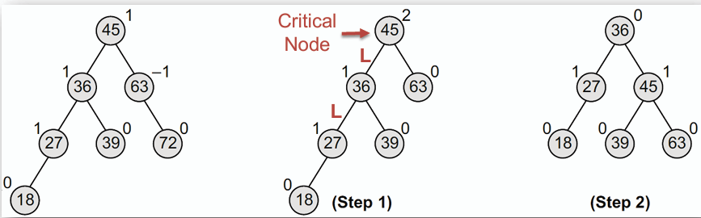

    刪除 72 後，使得根節點的平衡因子為 2，是 Left heavy 的情況，取根節點 45 的左子節點 36 作為新的根節點，而其平衡因子為 1，因此需要進行 R1 旋轉來恢復平衡。

    又因為 36 的平衡因子為 1，是 Left heavy 的情況，所以在兩個節點都為 Left heavy 的情況下，直接對根節點 45 進行雙左臂旋來恢復平衡。

  3. **R-1 旋轉(R-1 Rotation):** 用於旋轉後的新根原平衡因子為 -1 的情況，包含 RR 或 LR 旋轉。

  - 刪除 72

    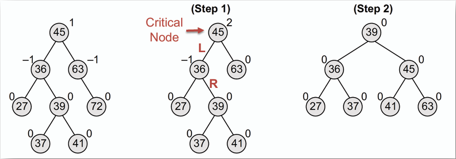

    刪除 72 後，使得根節點的平衡因子為 2，是 Left heavy 的情況，取根節點 45 的左子節點 36 作為新的根節點，而其平衡因子為-1，因此需要進行 R-1 旋轉來恢復平衡。

    又因為 36 的平衡因子為-1，是 Right heavy 的情況，因此需要先對 36 進行右臂旋，再對根節點 45 進行左臂旋來恢復平衡。

## 2-3 樹 2-3 Tree

**2-3 樹是一種自平衡的多路搜尋樹，其中每個節點可以有兩個或三個子節點，並且包含一至兩筆資料。(是一種 Degree = 3 的 B 樹)**

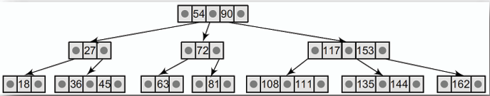

### 搜尋 Search

- **與二元搜尋樹的搜尋方法相同，從根節點開始，根據搜尋值與當前節點資料的比較結果，遞迴搜尋適當的子節點，直到找到該資料或達到葉節點。**

### 插入 Insert

- **從根節點開始，尋找適當的葉節點位置插入新資料。**
- **若葉節點有空位，直接插入新資料。**
- **若葉節點已滿(包含兩筆資料)，則將該節點分裂為兩個節點，並將中間的資料提升至父節點。**
- **若父節點也已滿，則遞迴進行分裂操作，直到達到根節點。**
- **若根節點分裂，則創建一個新的根節點，使樹的高度增加一層。**

- 插入 37

  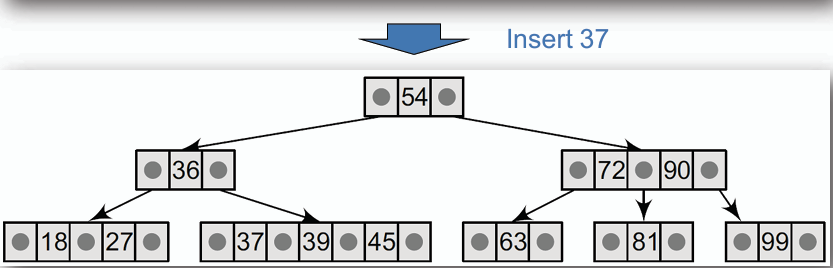

  插入 37 後，葉節點 [37, 39, 45] 已滿，因此將其分裂為兩個節點 [37] 和 [45]，並將中間的資料 39 提升至父節點。

  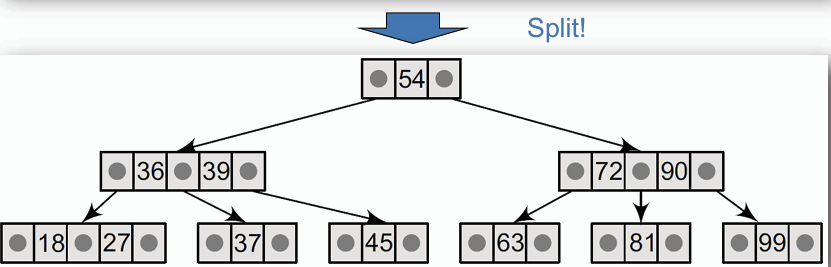

### 刪除 Delete

- **從根節點開始，尋找要刪除的資料所在的節點。**
- **當刪除的是內部節點時，則需在移除資料後，尋找其後中序表示法的繼節點進行替換。**
- **當刪除的是葉節點時，直接刪除該資料。**
- **若上述任何行為導致節點資料數量低於最低要求(即 1 筆資料)，則需進行合併或借用操作以恢復平衡。**

  1. **當一個點為空點時，需要借用其與手足節點(sibling node)夾擠的父節點的資料，並形成一個新的節點。**
  2. **當上述行為使得節點數超過最大值(即 2 筆資料)，則需進行分裂操作，將中間的資料提升至父節點。**
  3. **若有任一節點不合法，則重複上述步驟直到整棵樹合法為止。**

- **一個例子**
  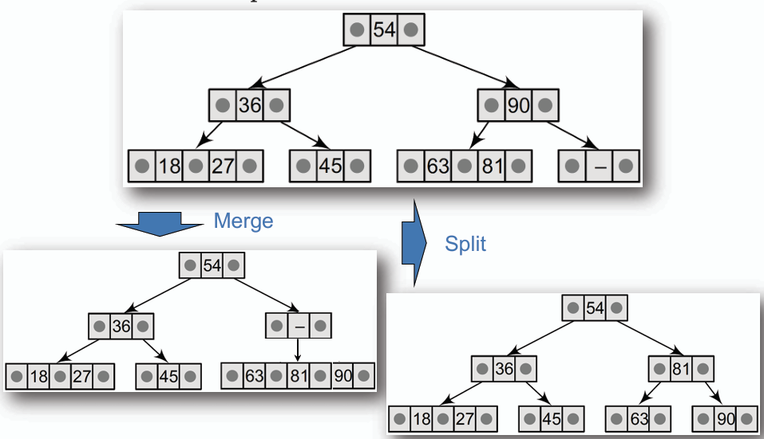

## 紅黑樹 Red-Black Tree

**紅黑樹是一種自平衡的二元搜尋樹，其中每個節點都被標記為紅色或黑色，並且遵循以下規則以確保樹的平衡:**

1. **每個節點要麼是紅色，要麼是黑色。**
2. **根節點必須是黑色。**
3. **所有葉節點(空節點)都是黑色。**
4. **如果一個節點是紅色，則其子節點必須是黑色(即不允許連續的紅色節點)。**
5. **從任一節點到其所有後代葉節點的路徑上，必須包含相同數量的黑色節點。**
6. **從根節點出發的最長路徑不會超過最短路徑的兩倍長度。**

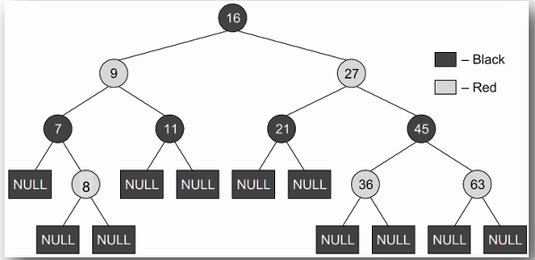

### 搜尋 Search

- **與二元搜尋樹的搜尋方法相同，從根節點開始，根據搜尋值與當前節點值的比較結果，遞迴搜尋左子樹或右子樹，直到找到該節點或達到葉節點。**

### 插入 Insert

- **與二元搜尋樹的插入方法相同，將新節點插入到適當的位置，並將其標記為紅色。**
- **插入新節點後，檢查並修正紅黑樹的規則，可能需要進行重新著色(recoloring)和旋轉(rotation)操作以恢復平衡。**

- **重新著色和旋轉操作包括:**

  - **重新著色(Recoloring):** 若出現有一個黑色節點擁有兩個紅色子節點的情況，則將該黑色節點重新著色為紅色，並將其兩個紅色子節點重新著色為黑色。
  - **旋轉(Rotation):** 若出現連續的紅色節點，則根據情況進行左臂旋(left rotation)或右臂旋(right rotation)來恢復平衡。

- **插入一個元素的執行規則:**

  1. **搜尋適合的位置用以插入新節點。**
  2. **若在搜尋過程中，出現了有兩個紅色子節點的黑色節點:**

     1. **將該黑色節點重新著色為紅色，並將其兩個紅色子節點重新著色為黑色。**
     2. **尋找是否出現連續的紅色節點，若有則進行旋轉操作以恢復平衡。**

  3. **插入欲插入的元素並將其標記為紅色。**
  4. **尋找是否出現連續的紅色節點，若有則進行旋轉操作以恢復平衡。**
  5. **確保根節點為黑色。**

  **助記規則:** ` Color Change → Rotation → Insert → Rotation → Check Root`

  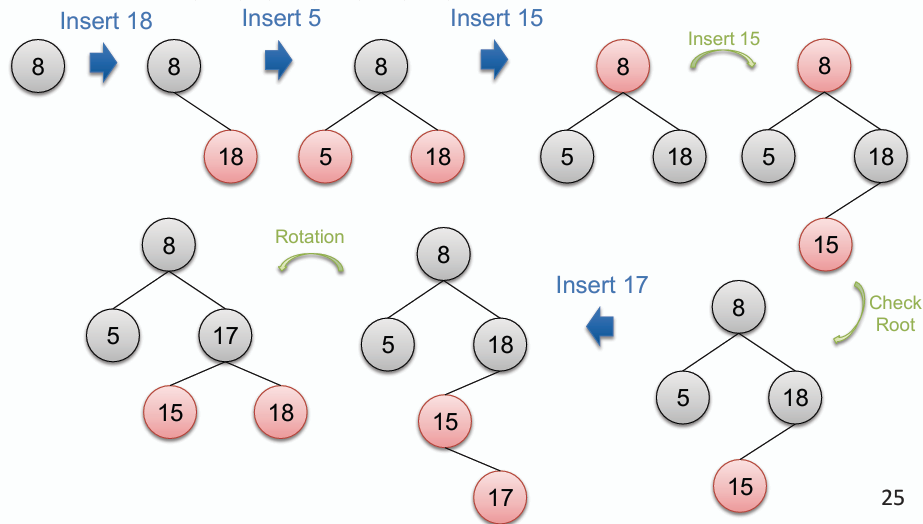

### 刪除 Delete

**課上未講解刪除部分，故此部分留空。**

### 與 AVL 樹的比較

- **AVL 樹較為嚴格地保持平衡，適合讀取頻繁且寫入較少的應用場景; 紅黑樹不具如此平衡的特性，但其能保證在讀取、寫入、刪除都至少為對數時間複雜度(O(log n))。**

- **兩者在相同數量級的時間複雜度下，紅黑樹通常具有較好的插入和刪除性能，因此較為靈活，其被廣泛運用在如 C++ STL 的 map 和 set 容器中。**

## B 樹 B-Tree

**B 樹是一種自平衡的多路搜尋樹(multi-way search tree)，對於階數(或稱為度, degree)為 m 的 B 樹，可以有 m-1 筆資料和 m 個指向子節點的指標。**

**其作為多路搜尋樹的特殊版本，除了具備上述特性，B 樹具有以下額外的特性:**

1. **根節點至少有兩個子節點。**
2. **每個節點最多有 m 個子節點(即最多有 m-1 筆資料)。**
3. **每個非根節點至少有⌈m/2⌉個子節點(即至少有⌈m/2⌉-1 筆資料)。**
4. **所有葉節點都位於同一階層。**

- m = 4(最多 4 個、最少 2 個子節點，最多 3 筆、最少 1 筆資料)的 B 樹範例:

  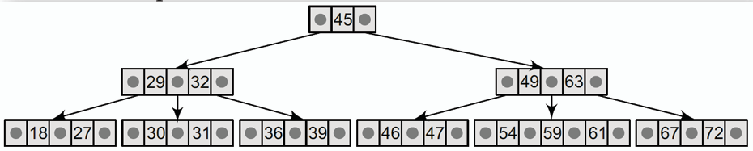

### 搜尋 Search

- **與二元搜尋樹的搜尋方法相似，從根節點開始，根據搜尋值與當前節點資料的比較結果，遞迴搜尋適當的子節點，直到找到該資料或達到葉節點。**

### 插入 Insert

- **從根節點開始，尋找適當的葉節點位置插入新資料。**
- **若葉節點有空位，直接插入新資料並排序。**
- **若葉節點已滿(包含 m-1 筆資料)，則將該節點分裂為兩個節點，並將中間的資料提升至父節點。(如同 2-3 樹的分裂操作)**

- **一個較為複雜，需要多次分裂的插入範例:(m = 5, 最多 5 個、最少 3 個子節點，最多 4 筆、最少 2 筆資料)**

  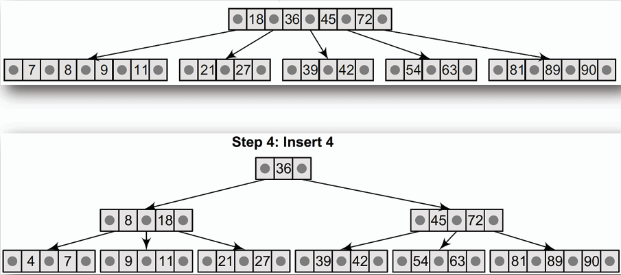

### 刪除 Delete

- **依照刪除位置及各節點元素數量的情況有所不同:**
  | 刪除位置 | 狀態 | 處理方式 |
  | ---- | ------------- | ------------------ |
  | 內部節點 | — | 用前驅或後繼替代，再轉為葉節點刪除 |
  | 葉節點 | 鍵值 > 最小 | 直接刪除 |
  | 葉節點 | 鍵值 = 最小，左兄弟可借 | 左兄弟最大鍵上推 → 父鍵下拉 |
  | 葉節點 | 鍵值 = 最小，右兄弟可借 | 右兄弟最小鍵上推 → 父鍵下拉 |
  | 葉節點 | 左右兄弟都不可借 | 合併節點 → 若父節點不足則向上調整 |

- **一個較為複雜，需要多次合併的刪除範例:(m = 5, 最多 5 個、最少 3 個子節點，最多 4 筆、最少 2 筆資料)**

  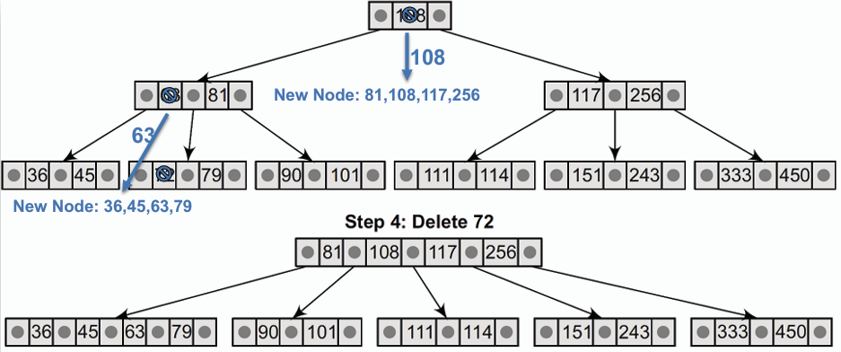

## B+ 樹 B+ Tree

**B+ 樹是一種自平衡的多路搜尋樹，是 B 樹的變體，其主要特點包括:**

- **所有資料都存放在葉節點(硬碟)，內部節點僅用於索引(記憶體)。**
- **葉節點之間透過鏈結串列(linked list)相連，便於範圍查詢(range query)和順序存取(sequential access)。**

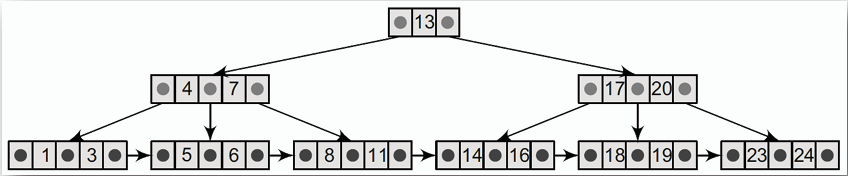

### 搜尋 Search

- **與二元搜尋樹的搜尋方法相同，從根節點開始，根據搜尋值與當前節點資料的比較結果，遞迴搜尋適當的子節點，直到找到該資料或達到葉節點。**

### 插入 Insert

- **從根節點開始，尋找適當的葉節點位置插入新資料。**
- **若葉節點有空位，直接插入新資料並排序。**
- **若葉節點已滿(包含 m-1 筆資料)，則將該節點分裂為兩個節點，並將右節點的最小值作為索引複製到父節點**
- **若是對內部節點(索引)進行分裂，則不須複製，直接提升。**

- **一個較為複雜，需要多次分裂的插入範例:(m = 4, 最多 4 個、最少 2 個子節點，最多 3 筆、最少 1 筆資料)**

  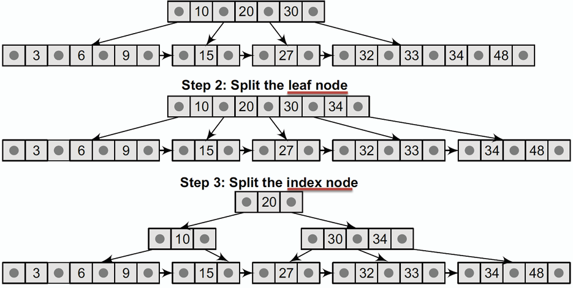

### 刪除 Delete

- **對於 B+ 樹的刪除操作，主要涉及葉節點的資料刪除，並根據需要進行節點的合併或借用，以維持樹的平衡和結構完整性。**
- **刪除葉節點相關操作後可能會遇到兩種情況:**

  1. **若葉節點的資料數量低於最低要求(即⌈m/2⌉-1 筆資料)，則與兄弟節點進行合併，並刪除其夾擠的索引。**
  2. **若內部節點(索引)的資料數量低於最低要求，則與兄弟節點以及他們夾擠的父節點合併組成新的節點。**

- **相關操作舉例:(m = 4, 最多 4 個、最少 2 個子節點，最多 3 筆、最少 1 筆資料)**

  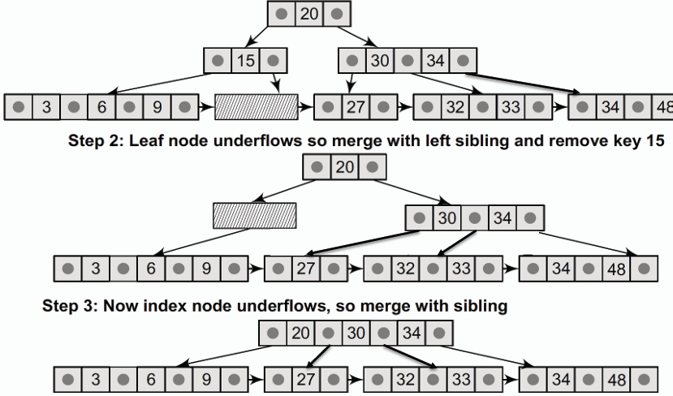

## 二元堆積 Binary Heap

**二元堆積是一種完全二元樹，分為最大堆積(max-heap)和最小堆積(min-heap)兩種形式。**

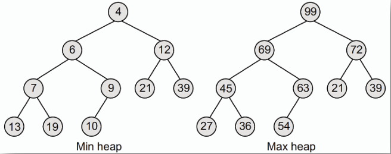

- ### 最大堆積 Max-Heap
  **在最大堆積中，每個節點的值都大於或等於其子節點的值，根節點擁有整個堆積中的最大值。**
- ### 最小堆積 Min-Heap
  **在最小堆積中，每個節點的值都小於或等於其子節點的值，根節點擁有整個堆積中的最小值。**

### 插入 Insert

- **將新元素插入到堆積的最後一個位置，然後依照他是 max 還是 min heap，透過「上浮(up-heap)」操作將其移動到適當的位置，以維持堆積的性質。**

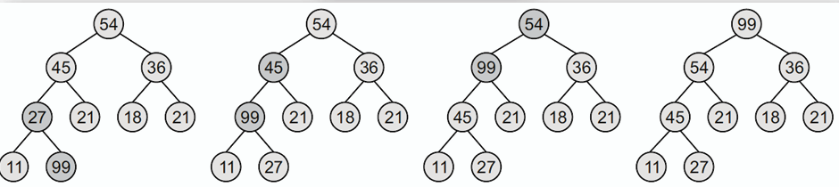

### 刪除 Delete

- **二元堆積通常只允許刪除根節點(最大或最小值)，刪除後，將最後一個元素移動到根節點位置，然後依照他是 max 還是 min heap，透過「下沉(down-heap)」操作將其移動到適當的位置，以維持堆積的性質。**

- 逐漸讓 11 下沉

  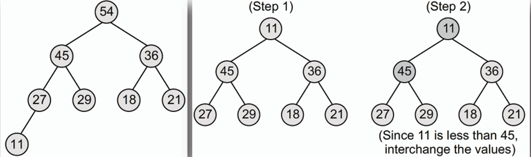

## 伸展樹 Splay Tree

**伸展樹是一種自調整的二元搜尋樹，透過在每次訪問節點後進行旋轉操作，將該節點移動到根節點位置，以提高後續訪問的效率。**

- **伸展樹的主要旋轉操作有三項:**

  1. **Zig 操作(類似 R 或 L rotation):** 當訪問的節點是其父節點的左/右子節點時，進行右/左旋轉。
  2. **Zig-Zig 操作(類似 LL 或 RR rotation):** 當訪問的節點和其父節點以及祖輩都是同一邊的節點時，先對父節點進行旋轉，再對訪問的節點進行旋轉。
  3. **Zig-Zag 操作(類似 LR 或 RL rotation):** 當訪問的節點是其父節點以及祖輩反邊的子節點，先對訪問的節點進行旋轉，再對訪問節點的父節點進行旋轉。

  **透過這些旋轉操作，伸展樹能夠將頻繁訪問的節點移動到樹的頂端，從而提高訪問效率。**

### 搜尋 Search

- **與二元搜尋樹的搜尋方法相同，從根節點開始，根據搜尋值與當前節點值的比較結果，遞迴搜尋左子樹或右子樹，直到找到該節點或達到葉節點。**
- **找到該節點後，進行伸展操作，將該節點移動到根節點位置。**
- **若未找到該節點，則對最後訪問的節點進行伸展操作。**

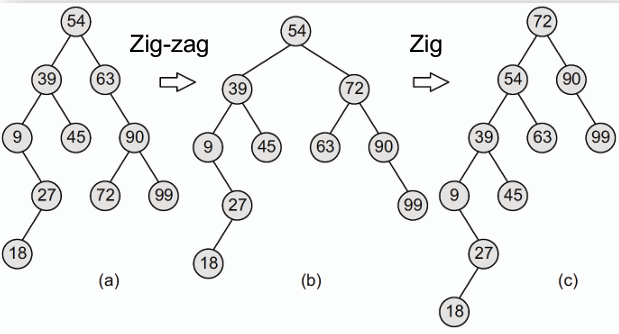

### 插入 Insert

- **與二元搜尋樹的插入方法相同，將新節點插入到適當的位置。**
- **插入新節點後，對該節點進行伸展操作，將其移動到根節點位置。**

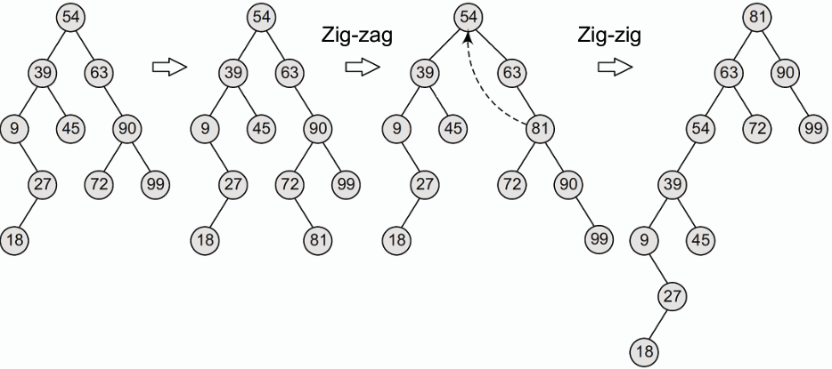

### 刪除 Delete

- **從根節點開始，尋找要刪除的節點。**
- **若找到該節點，對其進行伸展操作，將其移動到根節點位置。**
- **刪除根節點後，取左子樹最大或是右子樹最小的節點伸展至作為新的根節點，並合併成一棵新的樹。**

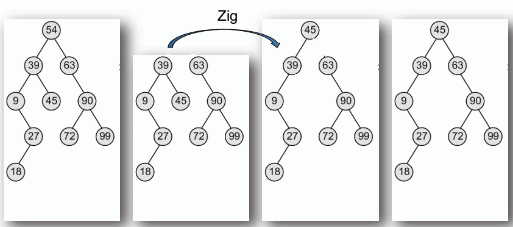

### 優劣勢分析 Pros & Cons

- **優勢**:其能夠自我調整，將頻繁訪問的節點移動到樹的頂端，提高訪問效率，很適合用在如快取(cache)等應用場景。且相較於其他自平衡樹(如 AVL 樹、紅黑樹)，伸展樹的實作較為簡單，無需維護額外的平衡資訊。
- **劣勢**:由於每次訪問都會進行伸展操作，可能導致樹的結構變得不平衡，從而影響其他節點的訪問效率。

## 霍夫曼樹 Huffman Tree

**霍夫曼樹是一種用於進行霍夫曼編碼的數，其核心思想在於將最常用的資料以較短的編碼表示，而較少用的資料以較長的編碼表示，從而達到資料壓縮的目的。**

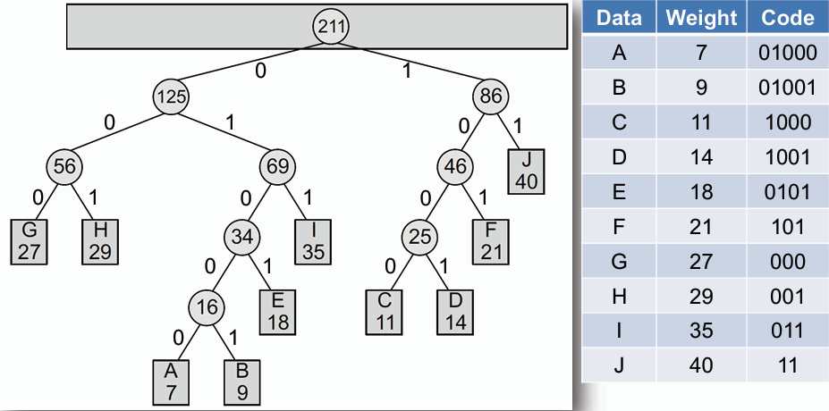

### 加權外部路徑長度 Weighted External Path Length (WPL)

**每個節點的權重(weight)通常是根據該節點所存在的階層作加權。**

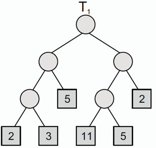

- **對於 T1 來說，其 WPL = :** `2×3+3×3+5×2+11×3+5×3+2×2=77`

### 建立霍夫曼樹的步驟 Steps to Build Huffman Tree

**給定一些帶有權重的節點，透過以下步驟來建立霍夫曼樹:**

1. **將所有節點按照權重從小到大排序，並將其視為獨立的樹。**
2. **從排序後的節點中，選擇兩個權重最小的節點，將它們合併成一個新的節點，該新節點的權重為兩個子節點權重之和。**
3. **將新節點插入到節點集合中，並重新排序。**
4. **重複步驟 2 和 3，直到所有節點都被合併成一棵樹為止。**

- 以此類推，最終形成的樹即為霍夫曼樹。
  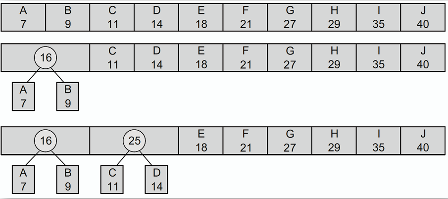

### 霍夫曼編碼&解碼 Huffman Coding & Decoding

**透過霍夫曼樹，可以為每個節點分配一個唯一的二進位編碼，該編碼是根據從根節點到該節點的路徑來決定的:向左走記為 0，向右走記為 1。**

- **編碼 Coding:**
  - **從根節點開始，根據要編碼的資料，沿著霍夫曼樹的路徑移動，直到到達對應的葉節點，並將沿途的二進位編碼組合起來，即為該資料的霍夫曼編碼。**
- **解碼 Decoding:**
  - **從霍夫曼編碼的起始位置開始，根據二進位編碼，沿著霍夫曼樹的路徑移動，遇到 0 則向左走，遇到 1 則向右走，直到到達葉節點，即為解碼後的資料。**

## 各種變體的比較

| 資料結構                    | 平衡性                           | 節點結構                     | 主要用途                   | 優勢                            | 劣勢                           | 插入時間複雜度           | 刪除時間複雜度           | 搜尋時間複雜度                   |
| --------------------------- | -------------------------------- | ---------------------------- | -------------------------- | ------------------------------- | ------------------------------ | ------------------------ | ------------------------ | -------------------------------- |
| **二元搜尋樹 (BST)**        | 不一定平衡                       | 每個節點最多 2 個子節點      | 基本搜尋與排序             | 實作簡單、直觀                  | 若輸入資料偏序，會退化成鏈     | 平均 O(log n)，最差 O(n) | 平均 O(log n)，最差 O(n) | 平均 O(log n)，最差 O(n)         |
| **AVL 樹**                  | 嚴格平衡 (高度差 ≤ 1)            | 每節點多存高度與平衡因子     | 需要快速搜尋的場景         | 搜尋效率佳 (接近理想 log n)     | 插入刪除較複雜，需要旋轉       | O(log n)                 | O(log n)                 | O(log n)                         |
| **2-3 樹**                  | 完全平衡                         | 節點可含 2~3 子樹            | 多路搜尋基礎樹             | 高度穩定，搜尋效率穩定          | 實作複雜                       | O(log n)                 | O(log n)                 | O(log n)                         |
| **紅黑樹**                  | 弱平衡（黑高平衡）               | 每節點多存顏色               | STL map、set、Java TreeMap | 插入刪除效率高於 AVL（少旋轉）  | 搜尋稍慢於 AVL                 | O(log n)                 | O(log n)                 | O(log n)                         |
| **B 樹**                    | 完全平衡，多路搜尋               | 每節點存多個 key 與子樹指標  | 檔案系統、資料庫索引       | 減少磁碟存取次數                | 實作較複雜                     | O(log n)                 | O(log n)                 | O(log n)                         |
| **B+ 樹**                   | 完全平衡，所有資料在葉節點       | 內部節點只存索引，葉節點串接 | 資料庫、檔案系統最常用索引 | 區間搜尋快速、磁碟存取效率高    | 搜尋單一值時需要到葉節點       | O(log n)                 | O(log n)                 | O(log n)                         |
| **二元堆積 (Binary Heap)**  | 不保證 BST 性質，只保證堆序      | 完全二元樹                   | 優先佇列 (Priority Queue)  | 取最大/最小值極快               | 無法快速搜尋特定值             | O(log n)                 | O(log n)                 | **O(1)** 取極值，搜尋其他值 O(n) |
| **伸展樹 (Splay Tree)**     | 根據存取頻率自我調整，不嚴格平衡 | 普通 BST 節點                | 熱點資料常被重複查詢       | 近期存取的元素極快 (平攤效率好) | 單次操作最差 O(n)              | 均攤 O(log n)            | 均攤 O(log n)            | 均攤 O(log n)                    |
| **霍夫曼樹 (Huffman Tree)** | 無需平衡，依頻率建滿二元樹       | 每節點存編碼權重             | 資料壓縮 (如 ZIP, JPEG)    | 能產生最省空間的前綴碼          | 只能用於編碼，不能用於一般查詢 | 建樹 O(n log n)          | 無刪除操作概念           | 編碼/解碼視樹深度，一般 O(n)     |

# 排序 Sorting Algorithms

**排序算法是將一組資料按照特定順序重新排列的過程。**

## 冒泡排序 Bubble Sort

- **概念:** 重複地遍歷要排序的資料列，依次比較相鄰的元素，若順序錯誤則交換位置，直到整個資料列有序為止。
- **時間複雜度:** 最佳 O(n^2)，最差 O(n^2)
- **虛擬碼 Pseudocode:**

  ```
  for i from 0 to n-1 do
      for j from 0 to n-i-2 do
          if A[j] > A[j+1] then
              swap A[j] and A[j+1]
  ```

- **範例:**

  排序: `A[] = {5, 2, 9, 1, 5, 6}`

  1. 比較 A[0] 和 A[1]，因為 5 > 2，交換位置: {2, 5, 9, 1, 5, 6}
  2. 比較 A[1] 和 A[2]，因為 5 < 9，不交換位置: {2, 5, 9, 1, 5, 6}
  3. 比較 A[2] 和 A[3]，因為 9 > 1，交換位置: {2, 5, 1, 9, 5, 6}
  4. 重複以上步驟直到整個陣列有序

  最終結果: `A[] = {1, 2, 5, 5, 6, 9}`

## 插入排序 Insertion Sort

- **概念:** 將資料分為已排序和未排序兩部分，從未排序部分取出一個元素，將其插入到已排序部分的適當位置，重複此過程直到所有元素均排序完成。
- **時間複雜度:** 最佳 O(n)，最差 O(n^2)
- **虛擬碼 Pseudocode:**

  ```
  for i from 1 to n-1 do
      key = A[i]
      j = i - 1
      while j >= 0 and A[j] > key do
          A[j + 1] = A[j]
          j = j - 1
      A[j + 1] = key
  ```

- **範例:**

  排序: `A[] = {5, 2, 9, 1, 5, 6}`

  1. 將 A[1] (2) 插入到已排序部分 {5}，結果: {2, 5}
  2. 將 A[2] (9) 插入到已排序部分 {2, 5}，結果: {2, 5, 9}
  3. 將 A[3] (1) 插入到已排序部分 {2, 5, 9}，結果: {1, 2, 5, 9}
  4. 重複以上步驟直到整個陣列有序

  最終結果: `A[] = {1, 2, 5, 5, 6, 9}`

  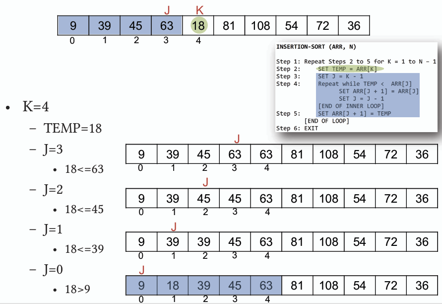

## 二元樹排序 Tree Sort

- **概念:** 將資料插入到二元搜尋樹中，然後進行中序遍歷以獲得排序後的資料。
- **時間複雜度:** 最佳 O(n log n)，平均 O(n log n)，最差 O(n^2)

## 堆積排序 Heap Sort

- **概念:** 將資料構建成最大或最小堆積，然後反覆取出堆頂元素並重建堆積，直到所有元素均排序完成。
- **時間複雜度:** 最佳 O(n log n)，平均 O(n log n)，最差 O(n log n)

## 選擇排序 Selection Sort

- **概念:** 重複地從未排序部分選擇最小(或最大)元素，將其放置在已排序部分的末尾，直到所有元素均排序完成。
- **時間複雜度:** 最佳 O(n^2)，最差 O(n^2)
- **虛擬碼 Pseudocode:**

  ```
  for i from 0 to n-1 do
      minIndex = i
      for j from i+1 to n-1 do
          if A[j] < A[minIndex] then
              minIndex = j
      swap A[i] and A[minIndex]
  ```

- **範例:**
  排序: `A[] = {5, 2, 9, 1, 7, 6}`

  1. 找到最小元素 1，交換位置: {1, 2, 9, 5, 7, 6}
  2. 找到最小元素 2，位置不變: {1, 2, 9, 5, 7, 6}
  3. 找到最小元素 5，交換位置: {1, 2, 5, 9, 7, 6}
  4. 重複以上步驟直到整個陣列有序

  最終結果: `A[] = {1, 2, 5, 6, 7, 9}`

  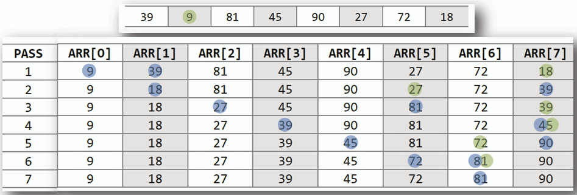

## 合併排序 Merge Sort

- **概念:** 將資料遞迴地分割成兩半，直到每個子陣列只有一個元素，然後將子陣列合併回來，並在合併過程中進行排序。
- **時間複雜度:** 最佳 O(n log n)，最差 O(n log n)
- **虛擬碼 Pseudocode:**

  ```
  function mergeSort(A, left, right)
      if left < right then
          mid = (left + right) / 2
          mergeSort(A, left, mid)
          mergeSort(A, mid + 1, right)
          merge(A, left, mid, right)

  function merge(A, left, mid, right)
      n1 = mid - left + 1
      n2 = right - mid
      create arrays L[0..n1-1] and R[0..n2-1]
      for i from 0 to n1-1 do
          L[i] = A[left + i]
      for j from 0 to n2-1 do
          R[j] = A[mid + 1 + j]
      i = 0; j = 0; k = left
      while i < n1 and j < n2 do
          if L[i] <= R[j] then
              A[k] = L[i]
              i = i + 1
          else
              A[k] = R[j]
              j = j + 1
          k = k + 1
      while i < n1 do
          A[k] = L[i]
          i = i + 1
          k = k + 1
      while j < n2 do
          A[k] = R[j]
          j = j + 1
          k = k + 1
  ```

- **範例:**
  排序: `A[] = {5, 2, 9, 1, 7, 6}`

  (單次 merge 過程，目前有兩陣列 L[] = {2,5,9} 及 R[] = {1,6,7} )

  1.

  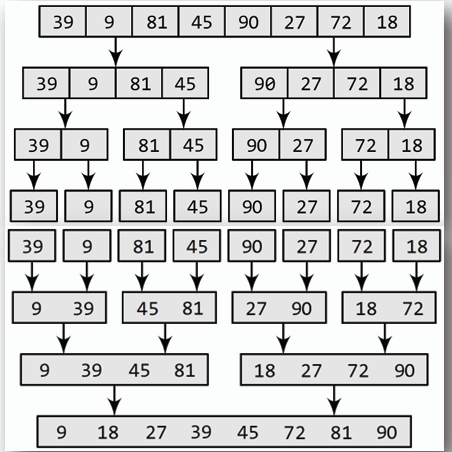

## 基數排序 Radix Sort

- **概念:** 根據每個元素的位數，從最低位到最高位依次進行排序，通常使用穩定排序算法(如計數排序)作為子排序算法。
- **時間複雜度:** O(kn)，其中 k 為最大數字的位數。

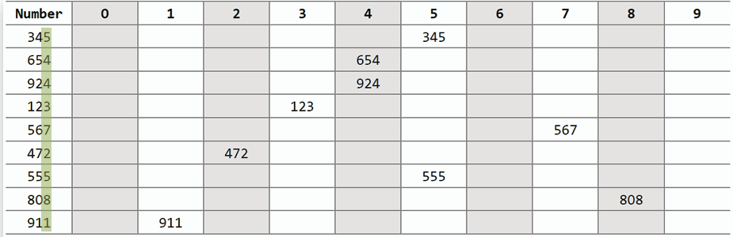

## 快速排序 Quick Sort

- **概念:** 選擇一個基準元素(pivot)，將資料分割成兩部分，一部分小於基準元素，另一部分大於基準元素，然後遞迴地對這兩部分進行排序。
- **時間複雜度:** 最佳 O(n log n)，平均 O(n log n)，最差 O(n^2)
- **虛擬碼 Pseudocode:**

  ```
  function quickSort(A, low, high)
      if low < high then
          pivotIndex = partition(A, low, high)
          quickSort(A, low, pivotIndex - 1)
          quickSort(A, pivotIndex + 1, high)

  function partition(A, low, high)
      pivot = A[high]
      i = low - 1
      for j from low to high - 1 do
          if A[j] <= pivot then
              i = i + 1
              swap A[i] and A[j]
      swap A[i + 1] and A[high]
      return i + 1
  ```

- **範例:**
  排序: `A[] = {5, 2, 9, 1, 7, 6}`

  (單次 partition 過程)

  1. 選擇基準元素 5 進行 partition，使 left 及 pivot 在其上，right 在 6 上。
  2. 因為 right > pivot，right 左移至 7(仍然合法)。
  3. 直至 right 移至 1(不合法)，停止。
  4. 交換 left 及 right 的值，並使 pivot 仍然於 5 的位置，結果: {1, 2, 9, 5, 7, 6}
  5. left 在 1 上，尚未達到停止條件，繼續右移至 2(合法)，再右移至 9(不合法)，停止。
  6. 交換 left 及 right 的值，並使 pivot 仍然於 5 的位置，結果: {1, 2, 5, 9, 7, 6}
  7. right 在 9 上，尚未達到停止條件，繼續左移至 5，此時 left 與 right 相遇，停止。

  最終結果: `A[] = {1, 2, 5, 6, 7, 9}`

  ## 希爾排序 Shell Sort

- **概念:** 將資料的長度除以 2 為 gap，把每單位 gap 的資料切開疊起來，縱向即為子陣列，對每個子陣列做插入排序，重複此過程直到 gap 為 1。
- **時間複雜度:** 最佳 O(n)，最差 O(n^2)
- **虛擬碼 Pseudocode:**

  ```
  function shellSort(A)
      gap = length(A)
      while gap > 1 do
          gap = (gap + 1) / 2
          for i from 0 to gap - 1 do
              insertionSortWithGap(A, i, gap)
  ```

- **範例:**
  排序: `A[] = {5, 2, 9, 1, 7, 6}`

  1. 初始 gap = 6，更新 gap = 3，分成三個子陣列: {5, 1}, {2, 7}, {9, 6}。
  2. 對每個子陣列進行插入排序，結果: {1, 5}, {2, 7}, {6, 9}，合併後: {1, 2, 6, 5, 7, 9}。
  3. 更新 gap = 2，分成兩個子陣列: {1, 6, 7}, {2, 5, 9}。
  4. 對每個子陣列進行插入排序，結果: {1, 5, 6, 7}, {2, 9}，合併後: {1, 2, 5, 6, 7, 9}。
  5. 更新 gap = 1，對整個陣列進行插入排序，結果: {1, 2, 5, 6, 7, 9}。

  最終結果: `A[] = {1, 2, 5, 6, 7, 9}`

  ## 性質-穩定性 Stability

- **穩定排序 Stable Sort:** 若兩個元素相等，排序後其相對位置不變。例如: 冒泡排序、插入排序、合併排序、二元樹排序、基數排序。
- **不穩定排序 Unstable Sort:** 若兩個元素相等，排序後其相對位置可能改變。例如: 選擇排序、快速排序、堆積排序、歇爾排序。

  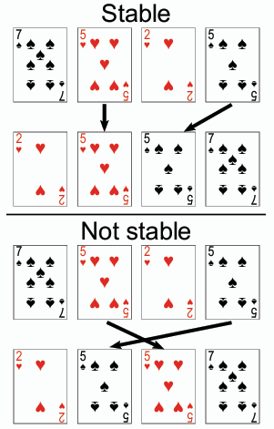

## 搜尋 Searching Algorithms

**搜尋算法是用於在資料結構中查找特定元素的過程。**

- ### 線性搜尋 Linear Search
  - **概念:** 從資料結構的第一個元素開始，逐一比較每個元素，直到找到目標元素或遍歷完整個資料結構。
- ### 二元搜尋 Binary Search
  - **概念:** 適用於已排序的資料結構，通過反覆將搜尋範圍縮小一半來查找目標元素。
- ### 插值搜尋 Interpolation Search
  - **概念:** 適用於均勻分布的已排序資料結構，根據目標元素與資料範圍的比例來估算下一個搜尋位置。
- ### 跳躍搜尋 Jump Search
  - **概念:** 適用於已排序的資料結構，通過跳躍固定步長來快速縮小搜尋範圍，然後進行線性搜尋。

# 圖 Graphs

**圖是一種由節點(vertices/nodes)和邊(edges)組成的資料結構，用於表示物件之間的關係。**

## 無向圖 Undirected Graph

### 定義 Definition

一個圖 G 可以表示為一對 G = (V, E)，其中:

- V(G) 是節點的集合，稱為頂點集(vertex set)，每個節點代表一個物件。
- E(G) 是邊的集合，稱為邊集(edge set)，每條邊連接兩個節點，表示它們之間的關係。

下圖為一個包含 5 個節點和 6 條邊的無向圖，其中:

- V(G) = {A, B, C, D, E}
- E(G) = {(A, B), (A, D), (B, C), (B, D), (C, E), (D, E)}

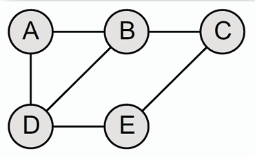

### 術語 Terminology

- **鄰接節點 Adjacent Nodes/neighbors:** 對每條邊來說，其中 e = (u, v) 連接節點 u 和 v，則 u 和 v 是彼此的鄰接節點。
- **度 Degree:** 節點 u 的度 deg(u) 是指與節點 u 相連的邊的數量。若 deg(u) = 0，則稱節點 u 為孤立節點(isolated node)。
- **路徑 Path:** 在圖中，一條路徑是由一系列相鄰節點組成的序列，表示從一個節點到另一個節點的連接方式。路徑 P 可以表示為 P = (v1, v2, ..., vk)，其中每對相鄰節點 (vi, vi+1) 都存在於邊集 E(G) 中。若 v1 = vk，則稱該路徑為閉路(closed path)。
- **簡單路徑 Simple Path:** 若路徑中沒有重複的節點，則稱該路徑為簡單路徑。(例外: 起點與終點可相同，形成閉路，稱為簡單閉路 closed simple path)

  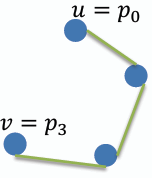

- **迴路 Cycle:** 若路徑的起點和終點是同一個節點，且路徑中至少包含一條邊，則稱該路徑為迴路，同於閉路。簡單迴路(simple cycle)是指除了起點和終點外，路徑中沒有重複的節點，同於簡單閉路。

  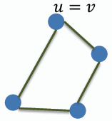

- **正則圖 Regular Graph:** 若圖中所有節點的度相同，則稱該圖為正則圖。

  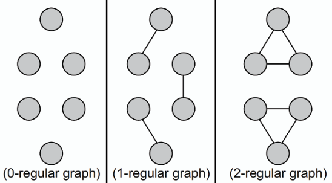

- **連通圖 Connected Graph:** 若圖中任意兩個節點之間都存在路徑(無孤立節點)，則稱該圖為連通圖。

  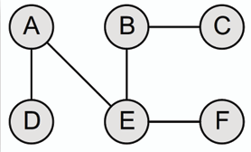

- **完全圖 Complete Graph:** 若圖中每對不同的節點之間都存在一條邊，則稱該圖為完全圖。且完全圖中節點數為 n 的圖，邊數為 n(n-1)/2。

  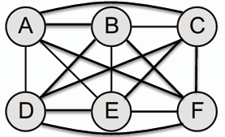

- **團 Clique:** 圖中的一個子集 S ⊆ V(G)，若 S 中的每對不同節點之間都存在一條邊，則稱 S 為圖 G 的一個團。

  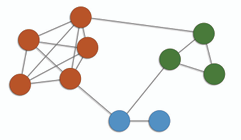

- **迴圈 Loop:** 若圖中存在一條邊連接節點 u 到自身，即 e = (u, u)，則稱該邊為迴圈。
- **多重邊 Multiedge:** 若圖中存在多條邊連接同一對節點 u 和 v，即 e1 = (u, v) 和 e2 = (u, v)，則稱這些邊為多重邊。
- **多重圖 Multigraph:** 若圖中允許存在迴圈和多重邊，則稱該圖為多重圖。
- **圖的大小 Size of a Graph:** 圖 G 的大小定義為其邊的總數，記為 |E(G)|。
- **關節點 Articulation Point:** 在連通圖中，若刪除節點 v 及其相關邊後，圖變為不連通，則稱節點 v 為關節點。

  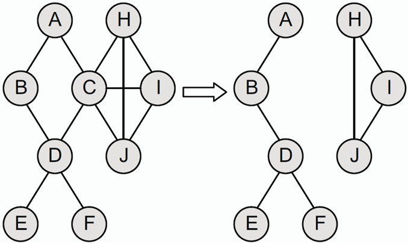

- **雙連通圖 Biconnected Graph:** 若圖中不存在關節點，則稱該圖為雙連通圖。
- **橋 Bridge:** 在連通圖中，若刪除邊 e 後，圖變為不連通(Disconnected)，則稱邊 e 為橋。

  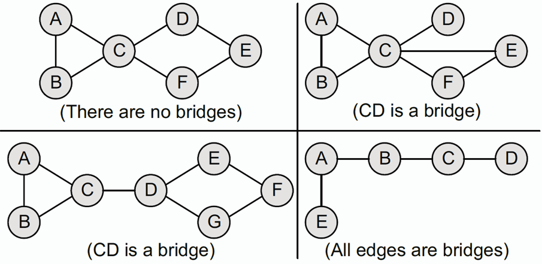

## 有向圖 Directed Graph

### 定義 Definition

一個有向圖 G 可以表示為一對 G = (V, E)，其中:

- V(G) 是節點的集合，稱為頂點集(vertex set)，每個節點代表一個物件。
- E(G) 是有向邊的集合，稱為邊集(edge set)，每條有向邊連接兩個節點，表示從一個節點指向另一個節點的關係。

下圖為一個包含 5 個節點和 6 條有向邊的有向圖，其中:

- V(G) = {A, B, C, D, E}
- E(G) = {(A, B), (A, D), (B, D), (C, B), (D, E), (E, C)}其中(u, v)表示有向邊從節點 u 指向節點 v(u -> v)。

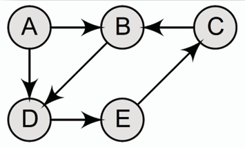

### 術語 Terminology

- **入度 Indegree:** 節點 v 的入度 indeg(v) 是指指向節點 v 的有向邊的數量。
- **出度 Outdegree:** 節點 u 的出度 outdeg(u) 是指從節點 u 指向其他節點的有向邊的數量。
- **度 Degree:** 節點 u 的度 deg(u) 是指與節點 u 相連的有向邊的總數，即 deg(u) = indeg(u) + outdeg(u)。
- **源點 Source Node:** 若節點 u 的入度 indeg(u) = 0 且 outdeg(u) > 0，則稱節點 u 為源點。
- **匯點 Sink Node:** 若節點 v 的出度 outdeg(v) = 0 且 indeg(v) > 0，則稱節點 v 為匯點。
- **吊墜節點 Pendant Node:** 若節點 w 的度 deg(w) = 1，則稱節點 w 為吊墜節點。
- **可及性 Reachability:** 在有向圖中，若存在一條有向路徑從節點 u 指向節點 v，則稱節點 v 可由節點 u 可及(reachable)。
- **平行/多重邊 Parallel/Multiedge:** 若有向圖中存在多條有向邊連接同一對節點 u 和 v，即 e1 = (u, v) 和 e2 = (u, v)，則稱這些邊為平行/多重邊。
- **強連通有向圖 Strongly Connected Directed Graph:** 若有向圖中任意兩個節點 u 和 v 之間都存在有向路徑從 u 指向 v 且從 v 指向 u，則稱該有向圖為強連通有向圖。

  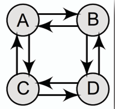

- **弱連通有向圖 Weakly Connected Directed Graph:** 若將有向圖中的所有有向邊視為無向邊後，所得的無向圖為連通圖，則稱該有向圖為弱連通有向圖。

  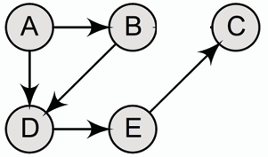

- **遞移閉包 Transitive Closure:** 在有向圖中，若存在有向路徑從節點 u 指向節點 v，則在遞移閉包中也存在一條直接的有向邊從 u 指向 v。換句話說，遞移閉包這張圖記錄了一點能不能走到另一點。

  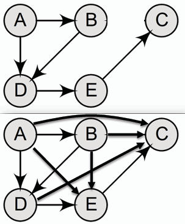

## 最小生成樹 Minimum Spanning Tree (MST)

**生成樹是一個連通無向圖的子集，一張圖可以有很多生成樹。生成樹必須是連通(connected)、無向(undirected)、無迴圈(No Loop)的。**

**而最小生成樹則是在所有可能的生成樹中，在為每條邊賦予權重(weight)的情況下，選擇總權重相等或是小於其他生成樹的生成樹。**

**可能會有很多的最小生成樹，取決於邊的權重分配。若所有邊的權重皆相同，則所有生成樹皆為最小生成樹；若邊的權重皆不同，則最小生成樹為唯一。而對於沒有權重的圖，可以將所有邊的權重視為相同，則所有生成樹皆為最小生成樹。**

### 普林演算法 Prim's Algorithm

**普林演算法是一種用於尋找最小生成樹的貪心算法，其核心思想是從一個節點開始，逐步擴展生成樹，直到包含所有節點為止。**

**口訣: `找鄰居->選最小->加入樹`**

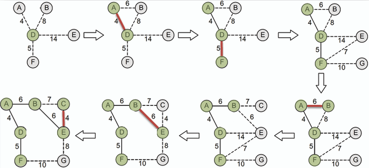

### 克魯斯克爾演算法 Kruskal's Algorithm

**克魯斯克爾演算法是一種用於尋找最小生成樹的貪心算法，其核心思想是從所有邊(E(G))中選擇權重最小的邊，並將其加入生成樹中，直到包含所有節點為止。若該圖未連通，則會找到最小生成森林。**

**口訣: `選小邊->加不通`**

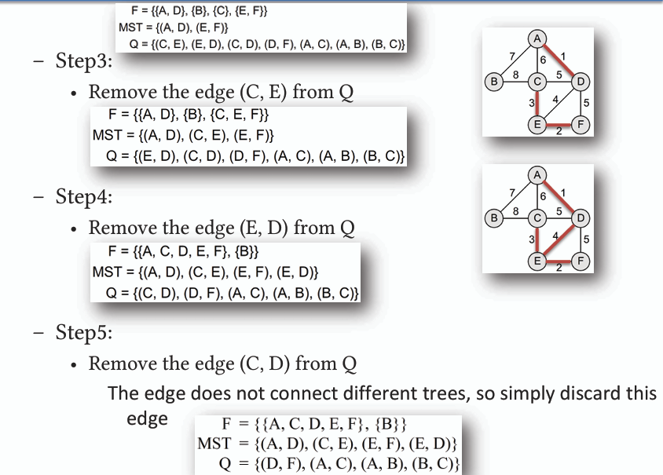

### 通用規則 general formulation

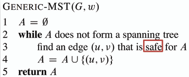

**在上述兩種演算法中，都以各自的準則選擇所謂的安全邊(safe edge)，即在不形成迴路的情況下，將邊加入生成樹中。**

- **普林演算法:** 從生成樹的節點出發，選擇與生成樹相連且權重最小的邊作為安全邊。
- **克氏演算法:** 從所有邊中選擇權重最小的邊，若該邊連接的兩個節點不曾經被連結過，則將其加入生成樹中作為安全邊。

## 圖的表示法 Graph Representation

**圖可以透過多種方式來表示，在電腦中儲存圖有三種常見方式:**

- **串列表示(Sequential Representation):** 使用鄰接矩陣(adjacency matrix)來表示圖，其中矩陣的行和列分別代表節點，矩陣中的元素表示節點之間是否存在邊。
- **鏈結表示(Linked Representation):** 使用鄰接串列(adjacency list)來表示圖，其中每個節點都有一個鏈接列表(Link List)，用來儲存節點的鄰居。
- **鄰接多重列表表示(Adjacency Multilist Representation):** 算是鄰接串列的進階版。

### 鄰接矩陣 Adjacency Matrix

**鄰接矩陣以一個 n x n 的二維陣列來表示一個有 n 個節點的圖，其中矩陣中的元素表示節點 n1 和節點 n2 之間是否存在邊，存在記為 1，不存在記為 0。(因此也被稱作比特矩陣 bit matrix 或是布林矩陣 boolean matrix)**

**一個一階的鄰接矩陣 A^1 表示圖中節點之間的直接連接關係，而更高階的鄰接矩陣 A^k 則表示節點之間是否可以透過 k 條邊連接起來。我們可以透過(A^1)^k 來計算。**

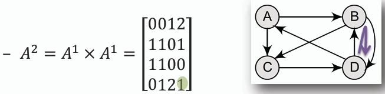

**鄰接矩陣還有一些推廣如下:**
**`B^k = A^1 + A^2 + ... + A^k`。**
**path matrix P 設定若存在從節點 i 到節點 j 的路徑，則 P[i][j] = 1，否則為 0。**

其他的一些鄰接矩陣:

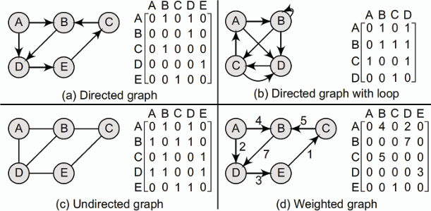

### 鄰接串列 Adjacency List

**鄰接串列通常被用來儲存邊數少至中等的圖，在電腦記憶體中，鄰接矩陣更適合用來儲存稀疏圖(sparse graph)，而鄰接串列則更適合用來儲存稠密圖(dense graph)。**

一些鄰接串列的範例:

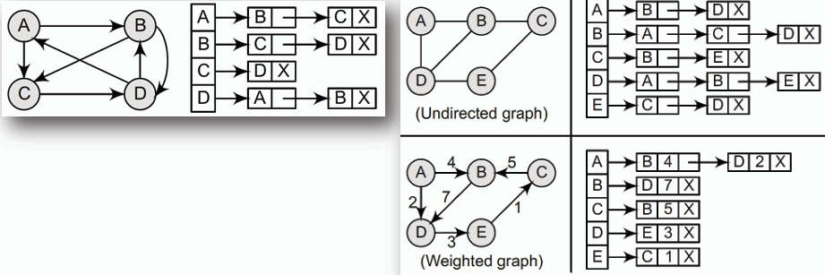

### 鄰接多重列表 Adjacency Multilist

**鄰接多重列表是鄰接列表的改良，他以基於邊的形式儲存資料，而藉由這個資料反向推出頂點的鄰接關係。**

範例:

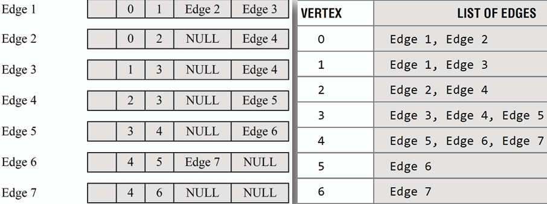

## 圖的遍歷 Graph Traversal

**圖的遍歷是指從圖中的一個節點開始，按照一定的規則訪問圖中的所有節點和邊的過程。常見的圖遍歷算法有深度優先搜尋(Depth-First Search, DFS)和廣度優先搜尋(Breadth-First Search, BFS)。**

### 廣度優先搜尋 Breadth-First Search (BFS)

**使用隊列(queue)來實現，從起始節點開始，先訪問該節點的所有鄰接節點，然後再依次訪問這些鄰接節點的鄰接節點，直到所有節點都被訪問為止。**

**在樹上對應到階序遍歷(level-order traversal)。**

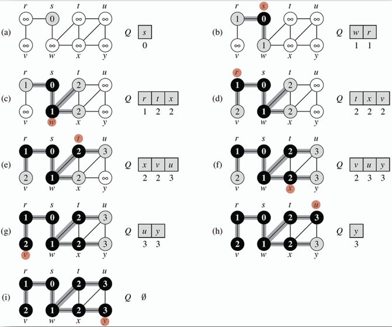

### 深度優先搜尋 Depth-First Search (DFS)

**使用堆疊(stack)來實現，從起始節點開始，沿著一條路徑一直深入訪問節點，直到無法繼續深入為止，然後回溯到上一個節點，繼續訪問其他未被訪問的鄰接節點，直到所有節點都被訪問為止。**

**在樹上對應到前序遍歷(pre-order traversal)。(樹的前序、中序、後序都可以透過 DFS 實現)**

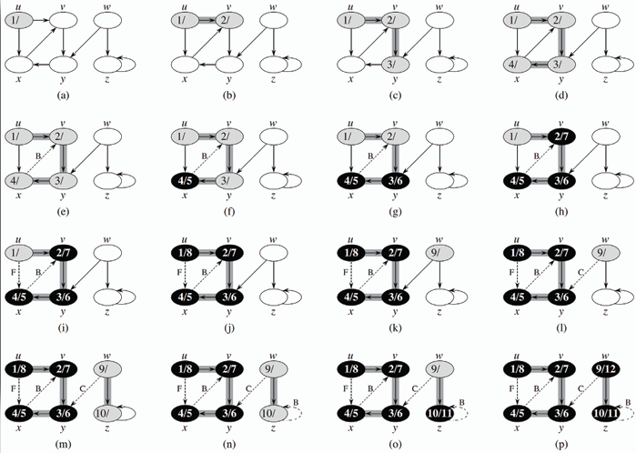

## 最短路徑演算法 Shortest Path Algorithms

**給定一張圖 G = (V, E)，其中 V 是節點集合，E 是邊集合，每條邊 (u, v) 有一個權重 w(u, v)。最短路徑問題是尋找從起始節點 s 到目標節點 t 的路徑，使得該路徑上所有邊的權重總和最小。**

### 戴克斯特拉演算法 Dijkstra's Algorithm

**戴克斯特拉演算法是一種用於尋找單源最短路徑的貪心算法，適用於邊權重非負的圖(有向圖或無向圖皆可)。其核心思想是從起始節點開始，將周遭的節點依照距離進行更新，並選擇距離最短的節點進行擴展，直到找到目標節點或所有節點的最短距離都被確定。**

**口訣: `選最近->放入已知->更新鄰居`**

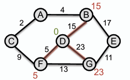

**以此無向圖為例:**

- **選定起點 D，放入已知集合 S={D}並標註為 0，更新鄰居 F = 5, B = 15, G = 23，而其他未知點保持無限大。**
- **選擇距離最近的節點 F，放入已知集合 S={D, F}並標註為 5，更新鄰居 C = 14, G = 18 (18 < 23，更新為 18)。**
- **選擇距離最近的節點 C，放入已知集合 S={D, F, C}並標註為 9，更新鄰居 A = 16。**
- **選擇距離最近的節點 B，放入已知集合 S={D, F, C, B}並標註為 15，更新鄰居 E = 32，鄰居 A 有新的權重 20，但 20 > 原權重 16，故不更新。**
- **選擇距離最近的節點 A，放入已知集合 S={D, F, C, B, A}並標註為 16，沒有新的可及的鄰居，不更新。**
- **選擇距離最近的節點 G，放入已知集合 S={D, F, C, B, A, G}並標註為 18，更新鄰居 E = 29 (29 < 32，更新為 29)。**
- **選擇距離最近的節點 E，放入已知集合 S={D, F, C, B, A, G, E}並標註為 29，此時所有節點均已放入已知集合，演算法結束。**

### 貝爾曼-福特演算法 Bellman-Ford Algorithm

**貝爾曼-福特演算法是一種用於尋找單源最短路徑的動態規劃算法，適用於邊權重可以為負的圖(有向圖或無向圖皆可)。其核心思想是通過反覆鬆弛(relaxation)邊來更新節點的最短距離，直到所有節點的最短距離都被確定。**

**演算法會返回一個布林值，表示是否存在從起點到其他節點的負權重迴路(negative-weight cycle)。若存在負權重迴路，則無法找到最短路徑，演算法返回 false；否則返回 true，並產生最短路徑以及節點各自的權重。**

**口訣: `重複鬆弛->更新距離`**

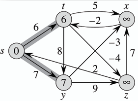

**以此有向圖為例:**

- **首先列出所有邊及權重:**

  - (t, x) = 5
  - (t, y) = 8
  - (t, z) = -4
  - (x, t) = -2
  - (y, x) = -3
  - (y, z) = 9
  - (z, x) = 7
  - (z, s) = 2
  - (s, t) = 6
  - (s, y) = 7

- **選定起點 s，初始化距離: d(s) = 0，其他節點距離皆為無限大。**

1. 第一次鬆弛:
   - 使用邊 (s, t): 更新 d(t) = 6 (s -> t)
   - 使用邊 (s, y): 更新 d(y) = 7 (s -> y)
   - 其他無限大，無意義
2. 第二次鬆弛:
   - 使用邊 (t, x): 更新 d(x) = 11 (6 + 5 = 11 < ∞)
   - 使用邊 (t, y): 無更新 (6 + 8 = 14 > 7)
   - 使用邊 (t, z): 更新 d(z) = 2 (6 + (-4) = 2 < ∞)
   - 使用邊 (x, t): 無更新 (∞ + (-2) = ∞ > 6)
   - 使用邊 (y, x): 更新 d(x) = 4 (7 + (-3) = 4 < 11)
   - 使用邊 (y, z): 無更新 (7 + 9 = 16 > 2)
   - 使用邊 (z, x): 無更新 (2 + 7 = 9 > 4)
   - 使用邊 (z, s): 無更新 (2 + 2 = 4 > 0)
   - 使用邊 (s, t): 無更新 (0 + 6 = 6 > 6)
   - 使用邊 (s, y): 無更新 (0 + 7 = 7 > 7)
3. 第三次鬆弛...

**持續進行鬆弛直到完成 V-1 次(其中 V 為節點數量)，並進入 check 階段，用以確認是否有負權重迴路。**

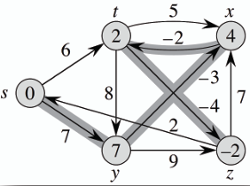

- check:
  - 使用邊 (t, x): 無更新 (4 < 2 + 5)
  - 使用邊 (t, y): 無更新 (7 < 2 + 8)
  - 使用邊 (t, z): 無更新 (-2 = 2 + (-4))
  - 使用邊 (x, t): 無更新 (2 = 4 + (-2))
  - 使用邊 (y, x): 無更新 (4 = 7 + (-3))
  - 使用邊 (y, z): 無更新 (-2 < 7 + 9)
  - 使用邊 (z, x): 無更新 (4 < -2 + 7)
  - 使用邊 (z, s): 無更新 (0 = -2 + 2)
  - 使用邊 (s, t): 無更新 (2 < 0 + 6)
  - 使用邊 (s, y): 無更新 (7 = 0 + 7)

**所有邊皆無法更新距離，表示不存在負權重迴路，成功找到最短路徑及各節點權重，演算法結束。**

### 比較

| 演算法                                   | 非負權重圖 | 負權重圖 | 負權重迴圈圖 |
| ---------------------------------------- | ---------- | -------- | ------------ |
| 戴克斯特拉演算法 Dijkstra's Algorithm    | 支援       | 不支援   | 不支援       |
| 貝爾曼-福特演算法 Bellman-Ford Algorithm | 支援       | 支援     | 支援         |

**由此可知，貝爾曼-福特演算法較為通用，但在非負權重圖中，戴克斯特拉演算法通常更有效率。**

**而二者所產生的最短路徑有可能不同，但是節點的權重最終會相同。**

---

# [本學期結束]
